# Lab 03 — Construction Inc. Office Network Part 2: Server & Services

**Tool:** Cisco Packet Tracer  
**Difficulty:** Beginner → Intermediate  
**Builds on:** Lab 02 — Construction Inc. Basic Office Network

---

## Scenario

Construction Inc. is growing. The office now needs a dedicated server to handle internal services — automatic IP assignment for staff devices, internal DNS so employees can reach the company website by name, an internal website with project updates, and shared file storage for construction documents. A network printer is also being added so all office PCs can print to a single shared device.

As the network technician, you will expand the existing Lab 02 network by adding a server and a printer, migrating PCs to DHCP, and configuring all services on the server.

---

## Objectives

- Add a server and configure it with a static IP
- Enable and configure DHCP so PCs receive addresses automatically
- Configure DNS so PCs can reach the server by name (`construction-inc.local`)
- Host an internal HTTP website on the server
- Set up an FTP share for document storage
- Add a network printer and connect it to the switch
- Verify all services are working from a PC

---

## Topology

```
                        RT-HQ (192.168.1.1)
                             |
                          SW-HQ
          ┌──────┬──────┬───┴────┬──────┬──────┬──────┐
      PC-1     PC-2   PC-3    PC-4   PC-5  SRV-HQ  PRT-HQ
    (DHCP)  (DHCP) (DHCP)  (DHCP)(DHCP) (.2)    (.50)
```

| Device | Hostname | IP Address | Assignment |
|---|---|---|---|
| Router | RT-HQ | 192.168.1.1 | Static |
| Server | SRV-HQ | 192.168.1.2 | Static |
| Printer | PRT-HQ | 192.168.1.50 | Static |
| PC-Office-1 to 5 | — | 192.168.1.100–149 | DHCP |

---

## Why Static vs DHCP?

| Device Type | Method | Reason |
|---|---|---|
| Router, Server, Printer | Static | Must always be at a known address — DNS, DHCP, and printing break if the IP changes |
| PCs, Laptops, Phones | DHCP | Staff and visiting contractors get an address automatically — no admin work needed |

This is standard practice in every real office network. So we will be simulating this in my lab.

---

## What Services Does Construction Inc. Need?

| Service | Why a construction company needs it |
|---|---|
| **DHCP** | Staff and contractors bring laptops to site meetings — automatic IP assignment means no manual config every time |
| **DNS** | Employees reach the internal site by typing `construction-inc.local` instead of memorising an IP address |
| **HTTP** | Internal company website — project status boards, health & safety notices, contact lists |
| **FTP** | Shared file server for architectural plans, blueprints, contracts, and site photos |
| **Printer** | All office PCs print to one shared network printer — invoices, contracts, site reports |

---

## Step-by-Step Build

### Step 1 — Opening my Lab 02 pkt File

I opened my saved `construction-inc.pkt` file from Lab 02. I also renamed it `construction-inc-pt2.pkt` so to differentiate it easier. We should see the existing topology: RT-HQ, SW-HQ, and PC-Office-1 through PC-Office-5.

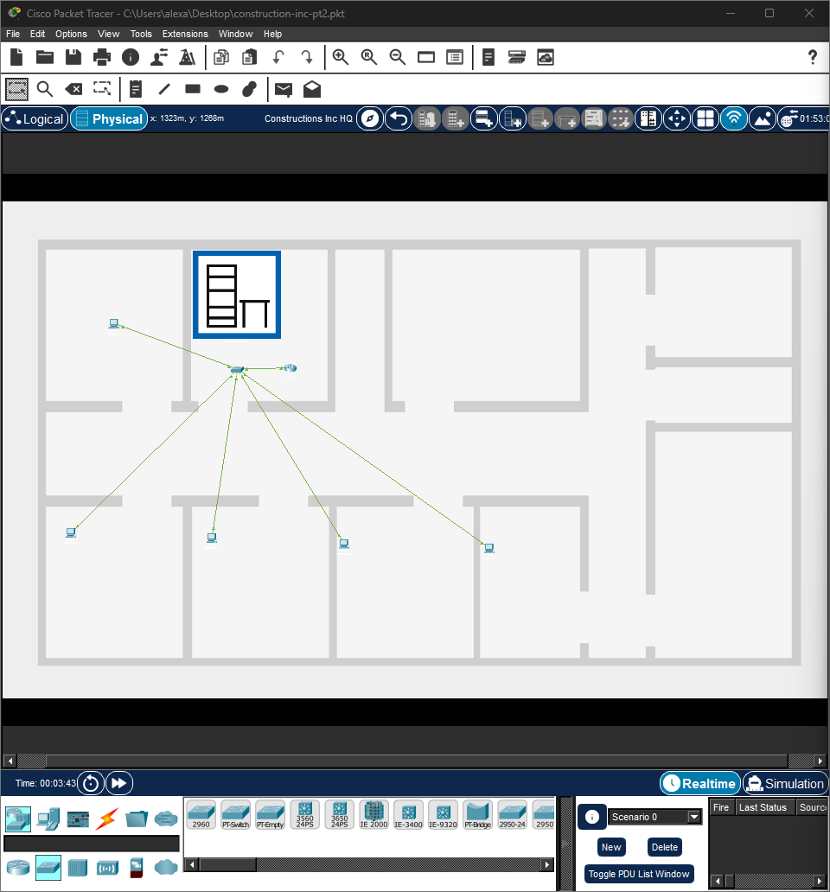
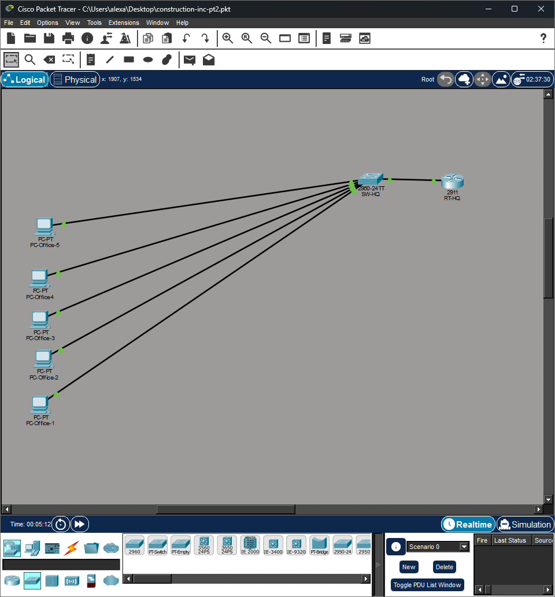
---

### Step 2 — Adding the Server

From the device panel I select **End Devices → Server** and dragged it onto the workspace. Placed it near the switch.

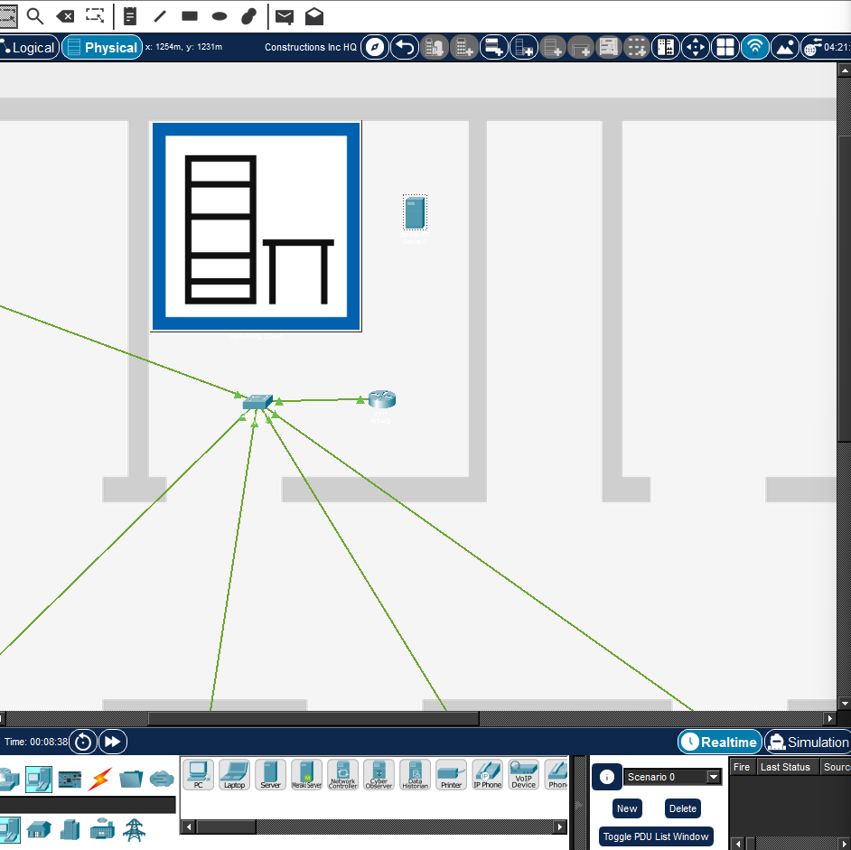

---

### Step 3 — Naming the Server

I clicked the server → **Config → Settings** and set the **Display Name** to `SRV-HQ`.

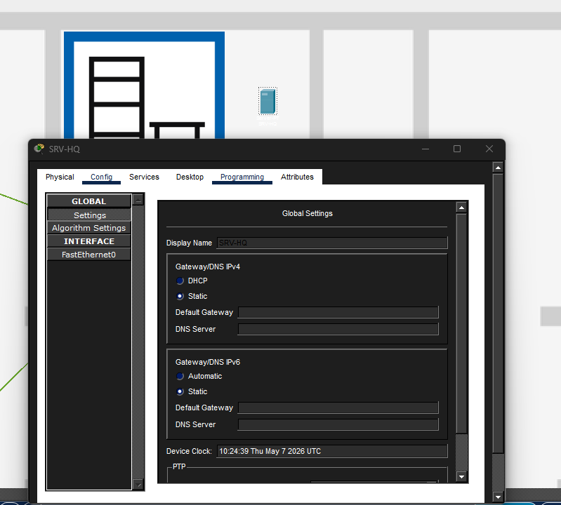

---

### Step 4 — Adding the Printer

From the device panel I selected **End Devices → Printer** and drag it onto the workspace.

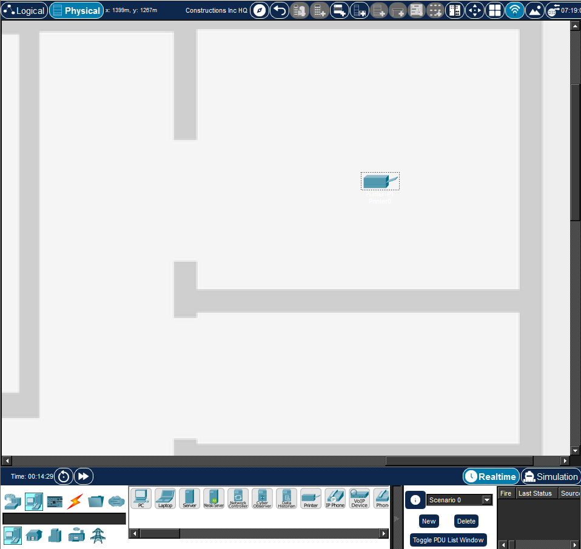

---

### Step 5 — Naming the Printer

I clicker the printer → **Config → Settings** and set the **Display Name** to `PRT-HQ`.

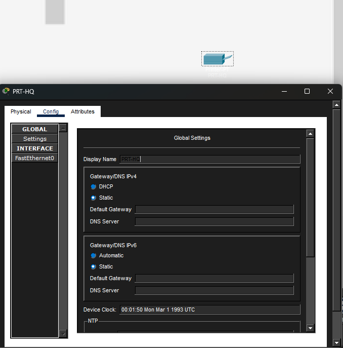

---

### Step 6 — Connecting the Server and Printer to the Switch

I used **Copper Straight-Through** cables to connect:
- `SRV-HQ FastEthernet0` → any free port on `SW-HQ`
- `PRT-HQ FastEthernet0` → any free port on `SW-HQ`

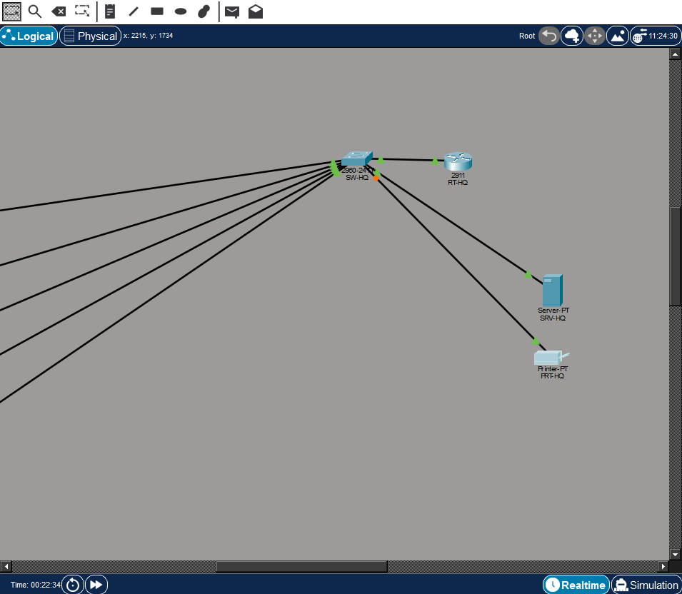

---

### Step 7 — Assigned a Static IP to the Server

I cllicked `SRV-HQ` → **Desktop → IP Configuration** and entered:

| Field | Value |
|---|---|
| IP Address | 192.168.1.2 |
| Subnet Mask | 255.255.255.0 |
| Default Gateway | 192.168.1.1 |
| DNS Server | 192.168.1.2 |

The server points to itself for DNS because it will be running the DNS service.

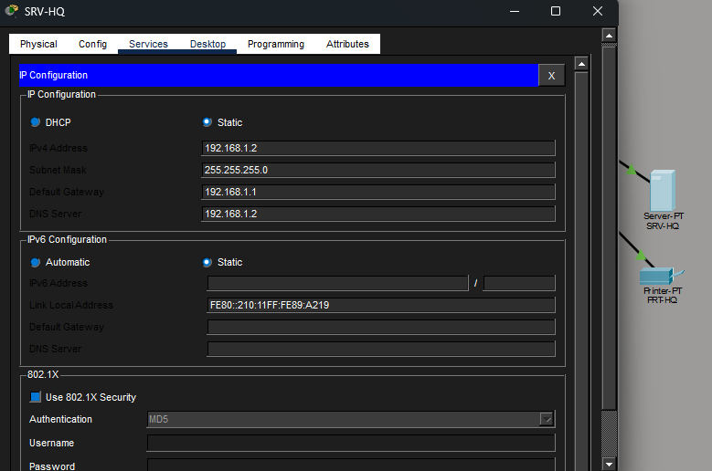

---

### Step 8 — Assigned a Static IP to the Printer

I clicked `PRT-HQ` → **Config → FastEthernet0** and entered:

| Field | Value |
|---|---|
| IP Address | 192.168.1.50 |
| Subnet Mask | 255.255.255.0 |

Then i've gone to **Settings** and entered:

| Field | Value |
|---|---|
| Default Gateway | 192.168.1.1 |

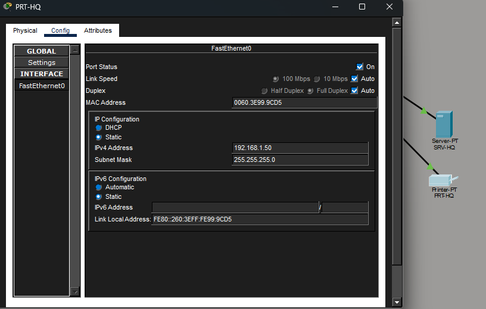
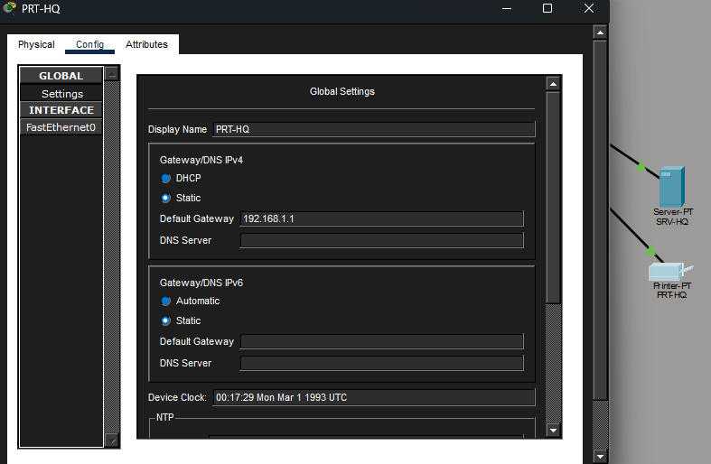

---

### Step 9 — Configuring DHCP on the Server

I clicked `SRV-HQ` → **Services → DHCP** and configure the pool:

| Field | Value |
|---|---|
| Pool Name | OfficePool |
| Default Gateway | 192.168.1.1 |
| DNS Server | 192.168.1.2 |
| Start IP Address | 192.168.1.100 |
| Subnet Mask | 255.255.255.0 |
| Max Users | 50 |

Clicked **Save**, then made sure the DHCP service toggle is set to **On**.

> The pool starts at `.100` to leave room below for static devices like the server (`.2`) and printer (`.50`).

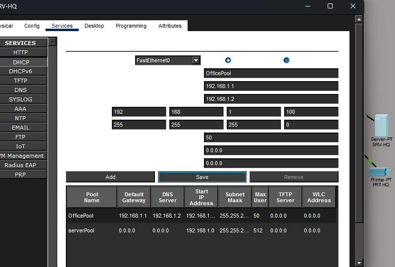

(Excuse my glitched interface, see [Step 11](#step-11--configuring-dns-on-the-server)) 

---

### Step 10 — Setting the PCs to DHCP

I click each PC individually (PC-Office-1 through PC-Office-5) → **Desktop → IP Configuration** and selected **DHCP** instead of Static.

Each PC has received an IP address in the `192.168.1.100–149` range within a few seconds.

PC-Office-5 has recieved the ip `192.168.1.7`

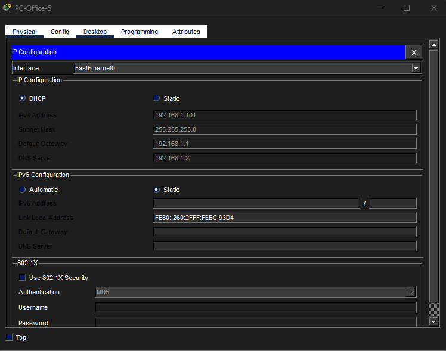

---

### Step 11 — Configuring DNS on the Server

Clicked `SRV-HQ` → **Services → DNS** and added the record:

| Field | Value |
|---|---|
| Name | construction-inc.local |
| Type | A Record |
| Address | 192.168.1.2 |

I clicked **Add**, then made sure DNS is toggled **On**.

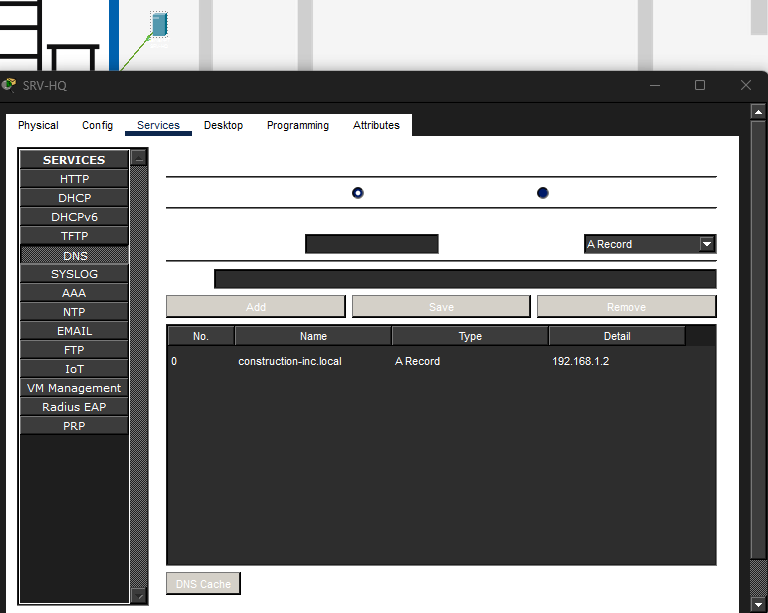

(Excuse the missing interface glitch. After a quick chat with gemini combined with prior experience I was able to efficiently & blindly configure both protocols in under 2 minutes, and I will be able to fix the GUI later)

---

### Step 12 — Configuring the HTTP Web Server

Clicked `SRV-HQ` → **Services → HTTP** and make sure HTTP is toggled **On**.

Click **Edit** on the default `index.html` file and replace the content with something representing the company:

```html
<html>
  <head><title>Construction Inc.</title></head>
  <body>
    <h1>Welcome to Construction Inc.</h1>
    <p>Internal portal — staff use only.</p>
    <p>For blueprints and project files, connect to the FTP server.</p>
  </body>
</html>
```

Clicked **Save**.

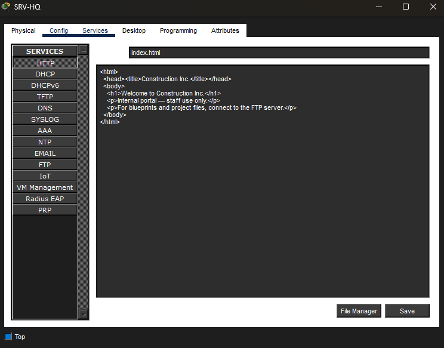

(Excuse my glitched interface, see [Step 11](#step-11--configuring-dns-on-the-server))

---

### Step 13 — Configure FTP on the Server

I clicked `SRV-HQ` → **Services → FTP** and made sure FTP is toggled **On**.

Then i added a user for file access:

| Field | Value |
|---|---|
| Username | staff |
| Password | cisco |
| Permissions | Read, Write, Delete, Rename, List |

Clicked **Add**.

> In a real environment I would use stronger credentials and per-user permissions. This is simplified for lab purposes.

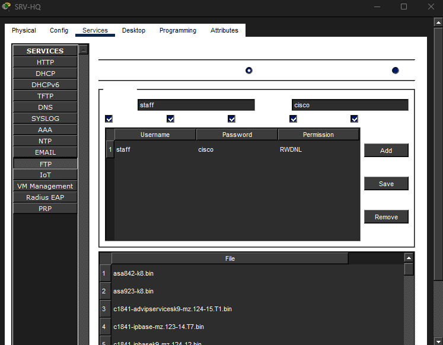

(Excuse my glitched interface, see [Step 11](#step-11--configuring-dns-on-the-server))

---

### Step 14 — Verifying HTTP from a PC

On any PC i clicked → **Desktop → Web Browser** and typed:

```
http://construction-inc.local
```

We should see the Construction Inc. internal homepage. This confirms DHCP, DNS, and HTTP are all working together.

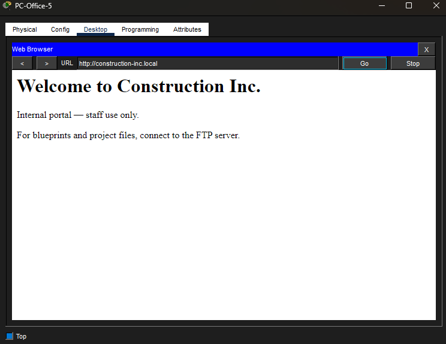

---

### Step 15 — Verify FTP from a PC

I clicked on any PC → **Desktop → Command Prompt** and typed:

```
ftp 192.168.1.2
```

When prompted, I entered username `staff` and password `cisco`. A successful login confirms FTP is working.

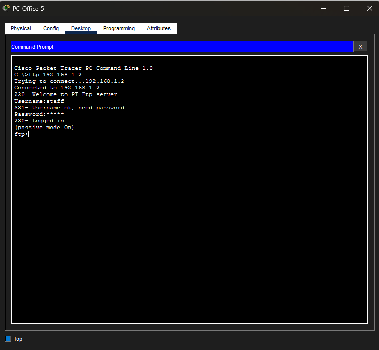

---

### Step 16 — Verifying Printer Connectivity

On any PC I clicked → **Desktop → Command Prompt** and pinged the printer:

```
ping 192.168.1.50
```

A successful reply confirms the printer is reachable on the network.

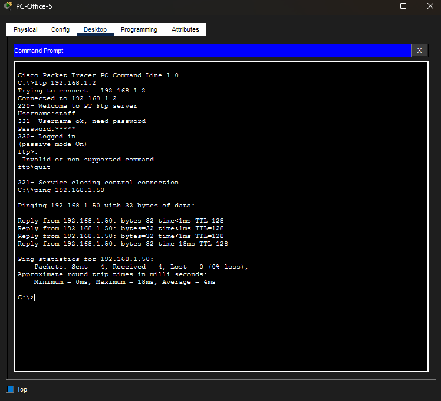

---

### Step 17 — Full Connectivity Check

From `PC-Office-1`, ping every key device to confirm the full network is healthy:

```
ping 192.168.1.1    ← router (default gateway)
ping 192.168.1.2    ← server
ping 192.168.1.50   ← printer
ping 192.168.1.102  ← another PC (might differ)
```

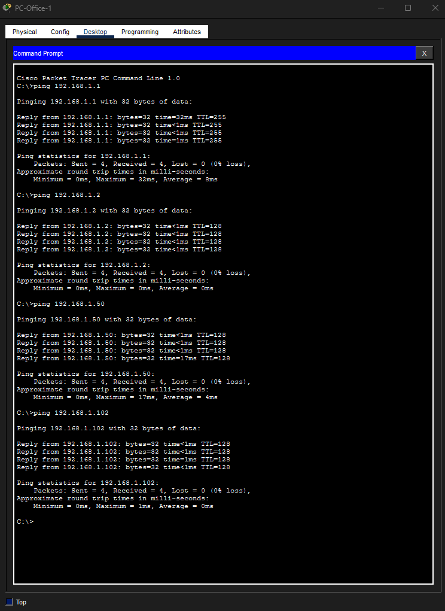

---

## What I Learned

- How to add and configure a server in Cisco Packet Tracer
- Why servers and printers use static IPs while client PCs use DHCP
- How to configure a DHCP pool so devices get addresses automatically
- How DNS resolves a hostname (`construction-inc.local`) to an IP address
- How to host an internal HTTP webpage and customise it
- How to set up an FTP server for shared file storage
- How to add a network printer and verify it is reachable
- How all these services work together in a single office network

---

## Compared to Previous Labs

| | Lab 01 | Lab 02 | Lab 03 |
|---|---|---|---|
| Tool | GNS3 | Packet Tracer | Packet Tracer |
| Devices | 2 PCs | 5 PCs, switch, router | + server, printer |
| IP Assignment | Static | Static | DHCP (PCs) + Static (infra) |
| Services | None | None | DHCP, DNS, HTTP, FTP |
| Verification | Ping | Ping | Ping + browser + FTP login |

---

## Files

```
lab-03-construction-inc-pt2/
├── README.md
├── construction-inc-pt2.pkt        ← Packet Tracer save file
└── screenshots/
    ├── 01-open-lab02.png
    ├── 02-add-server.png
    ├── 03-name-server.png
    ├── 04-add-printer.png
    ├── 05-name-printer.png
    ├── 06-connect-server-printer.png
    ├── 07-server-static-ip.png
    ├── 08-printer-static-ip.png
    ├── 09-dhcp-config.png
    ├── 10-pc-dhcp.png
    ├── 11-dns-config.png
    ├── 12-http-config.png
    ├── 13-ftp-config.png
    ├── 14-http-verify.png
    ├── 15-ftp-verify.png
    ├── 16-ping-printer.png
    └── 17-full-ping-check.png
```