# Lab 04 — Construction Inc. VLANs: Segmenting the Office Network

**Tool:** Cisco Packet Tracer  
**Difficulty:** Intermediate  
**Builds on:** Lab 03 — Construction Inc. Office Network Part 2

---

## Scenario

Construction Inc. has grown and the IT manager has raised a security concern: every device on the network can freely communicate with every other device. The management team's PCs are on the same network segment as the site workers' laptops and the server room equipment. This is a flat network and flat networks are a security risk.

My job will be to segment the Construction Inc. network into three VLANs representing real company departments, while keeping inter-department communication working through the router.

---

## Objectives

- Understand why flat networks are a problem in a real office
- Create and name VLANs on a Cisco switch via CLI
- Assign switch ports to the correct VLANs (access ports)
- Configure a trunk link between the switch and the router
- Set up Router-on-a-Stick (subinterfaces) for inter-VLAN routing
- Configure DHCP pools per VLAN so each department gets the right addresses
- Verify that VLANs are isolated by default and routed correctly

---

## The Problem With Lab 03's Network

In Lab 03, every device shared `192.168.1.0/24`. This means:
- A site worker's PC could ping the server directly with no restrictions
- A compromised laptop could reach the printer and management PCs freely
- There is no logical separation between departments

VLANs solve this by creating separate broadcast domains on the same physical switch — as if each department had its own dedicated switch.

---

## VLAN Design

| VLAN ID | Name | Devices | Subnet | Gateway |
|---|---|---|---|---|
| VLAN 10 | Management | PC-Office-1, PC-Office-2 | 192.168.10.0/24 | 192.168.10.1 |
| VLAN 20 | Staff | PC-Office-3, PC-Office-4, PC-Office-5 | 192.168.20.0/24 | 192.168.20.1 |
| VLAN 30 | Infrastructure | SRV-HQ, PRT-HQ | 192.168.30.0/24 | 192.168.30.1 |

---

## IP Addressing

| Device | VLAN | IP Address | Assignment |
|---|---|---|---|
| RT-HQ (subinterface Fa0/0.10) | 10 | 192.168.10.1 | Static |
| RT-HQ (subinterface Fa0/0.20) | 20 | 192.168.20.1 | Static |
| RT-HQ (subinterface Fa0/0.30) | 30 | 192.168.30.1 | Static |
| SRV-HQ | 30 | 192.168.30.2 | Static |
| PRT-HQ | 30 | 192.168.30.50 | Static |
| PC-Office-1 | 10 | 192.168.10.100+ | DHCP |
| PC-Office-2 | 10 | 192.168.10.100+ | DHCP |
| PC-Office-3 | 20 | 192.168.20.100+ | DHCP |
| PC-Office-4 | 20 | 192.168.20.100+ | DHCP |
| PC-Office-5 | 20 | 192.168.20.100+ | DHCP |

---

## Topology

```
         RT-HQ
         Fa0/0 (trunk)
            |
         SW-HQ
    ┌───────┼───────┐
  VLAN10  VLAN20  VLAN30
  ┌─┴─┐  ┌─┴──┐  ┌──┴──┐
 PC1 PC2 PC3 PC4 PC5 SRV PRT
```

The single cable between SW-HQ and RT-HQ carries all three VLANs as a **trunk link**. The router uses subinterfaces (one per VLAN) to route between them, this is called **Router-on-a-Stick**.

---

## Key Concepts Before Starting

**Access port** - a switch port assigned to one VLAN. The connected device has no idea VLANs exist. Used for PCs, servers, printers.

**Trunk port** - a switch port that carries traffic for multiple VLANs simultaneously using 802.1Q tagging. Used for the uplink between the switch and the router.

**Router-on-a-Stick** - a technique where one physical router interface handles multiple VLANs using logical subinterfaces. Each subinterface acts as the default gateway for one VLAN.

**Inter-VLAN routing** - by default, devices on VLAN 10 cannot reach devices on VLAN 20. The router is what allows controlled communication between VLANs.

---

## Step-by-Step Build

### Step 1 — Opening my Lab 03 File

Opened `construction-inc-pt2.pkt` from Lab 03. I will build on this existing topology rather than starting from scratch.

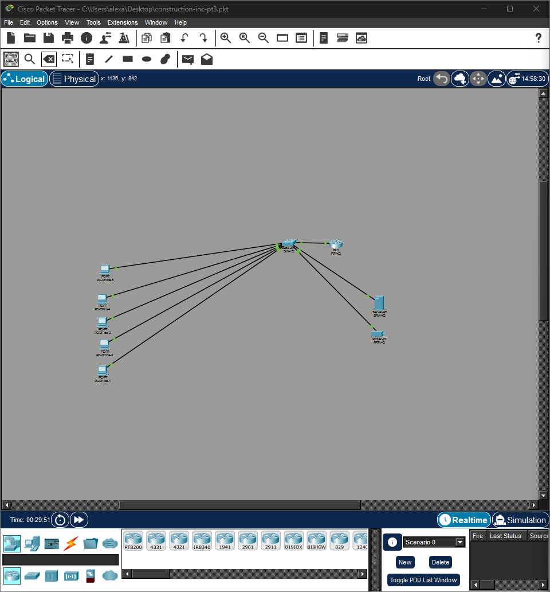

---

### Step 2 — Creating VLANs on the Switch

I clicked on `SW-HQ` → **CLI** tab and entered the following:

```
enable
configure terminal

vlan 10
 name Management
vlan 20
 name Staff
vlan 30
 name Infrastructure

end
```

Verifying the VLANs were created:

```
show vlan brief
```

We should see VLAN 10, 20, and 30 listed with their names.


---

### Step 3 — Assigning Access Ports for VLAN 10 (Management)

Still on `SW-HQ` CLI, I assigned the ports connected to PC-Office-1 and PC-Office-2 to VLAN 10.

> I checked which ports the PCs are on using by hovering over the cables in Packet Tracer.

```
configure terminal

interface FastEthernet0/1
 switchport mode access
 switchport access vlan 10

interface FastEthernet0/2
 switchport mode access
 switchport access vlan 10

end
```

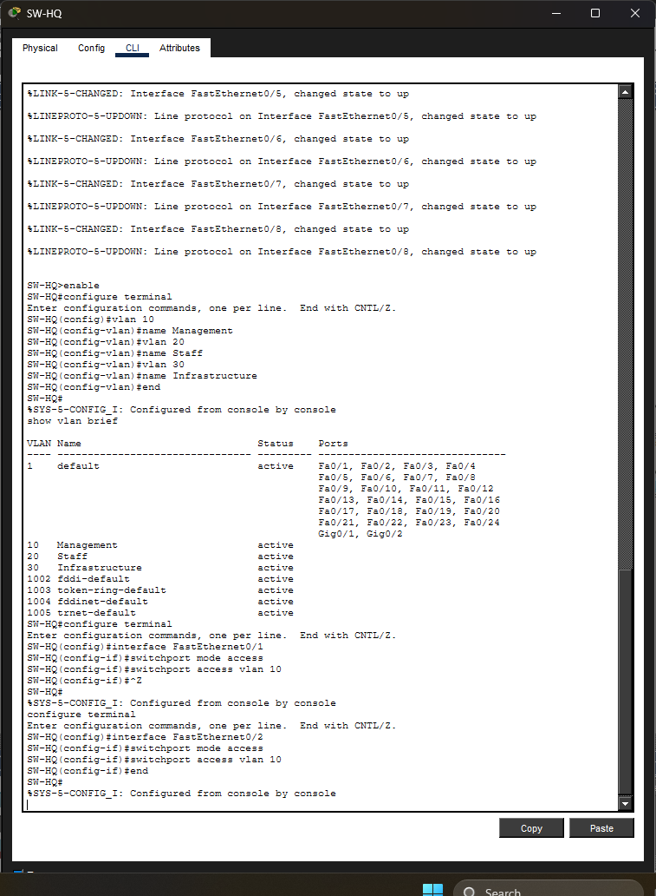

---

### Step 4 — Assigning Access Ports for VLAN 20 (Staff)

```
configure terminal

interface FastEthernet0/3
 switchport mode access
 switchport access vlan 20

interface FastEthernet0/4
 switchport mode access
 switchport access vlan 20

interface FastEthernet0/5
 switchport mode access
 switchport access vlan 20

end
```

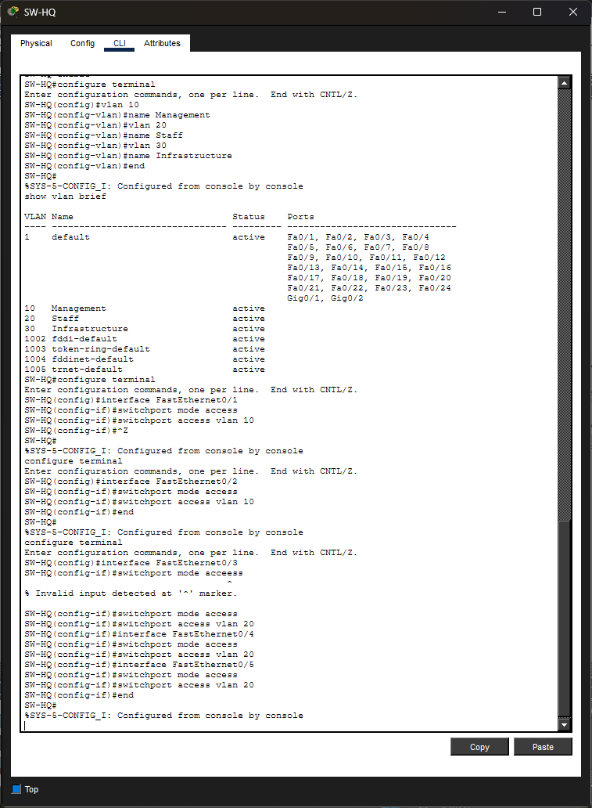

---

### Step 5 — Assigning Access Ports for VLAN 30 (Infrastructure)

```
configure terminal

interface FastEthernet0/6
 switchport mode access
 switchport access vlan 30

interface FastEthernet0/7
 switchport mode access
 switchport access vlan 30

end
```

I forgot checking the ports this time, correct ones actually being Fa0/7 and Fa0/8, but i remediated this by removing VLAN 30 from Fa0/6 and adding it to Fa0/8. Easy fix with the following commands:

```
configure terminal

interface FastEthernet0/6
 no switchport access vlan 30
 switchport mode access
 switchport access vlan 1

interface FastEthernet0/8
 switchport mode access
 switchport access vlan 30

end
```

Then I verified everything looks correct by typing:

```
show vlan brief
```


---

### Step 6 — Configuring the Trunk Port on the Switch

The port connecting `SW-HQ` to `RT-HQ` must be a trunk so it carries all VLANs. `Fa0/6` is my actual uplink port.

```
configure terminal

interface FastEthernet0/6
 switchport mode trunk 

end
```

I verified with:

```
show interfaces trunk
```

We should see the port listed as a trunk carrying VLANs 10, 20, and 30.

At first I did have some problems as Fa0/6 seemed to have been on VLAN as I assumed it was either the printer or the server, but I was wrong. 

This has taught me to check the ports before entering any commands in the CLI to avoid any problems. See [Troubleshooting & Lessons Learned](#troubleshooting--lessons-learned)

This is how i fixed it:

```
configure terminal

interface FastEthernet0/6
 no switchport access vlan
 switchport mode trunk

end
```

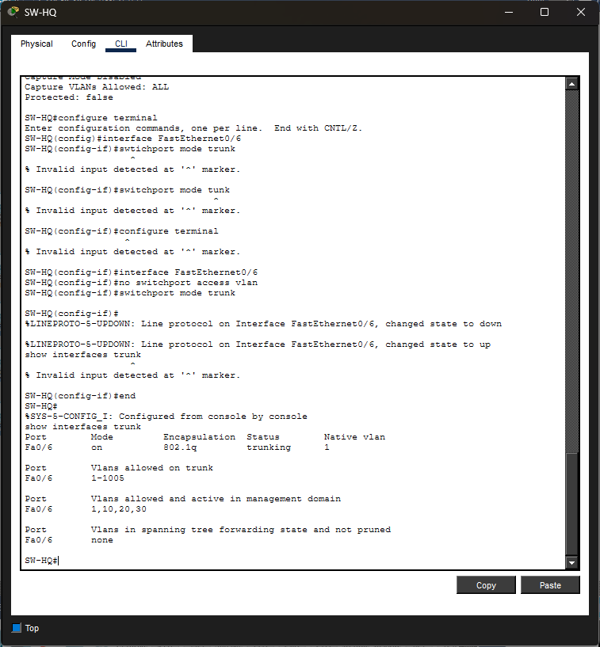


---

### Step 7 — Configuring Router Subinterfaces (Router-on-a-Stick)

I clicked `RT-HQ` → **CLI** and replaced the old single interface config with subinterfaces:

```
enable
configure terminal

interface GigabitEthernet0/0
 no ip address
 no shutdown

interface GigabitEthernet0/0.10 
 encapsulation dot1Q 10
 ip address 192.168.10.1 255.255.255.0

interface GigabitEthernet0/0.20
 encapsulation dot1Q 20
 ip address 192.168.20.1 255.255.255.0

interface GigabitEthernet0/0.30
 encapsulation dot1Q 30
 ip address 192.168.30.1 255.255.255.0

end
```

Each subinterface is the default gateway for its VLAN. The `encapsulation dot1Q` command tells the router which VLAN tag to expect on that subinterface.

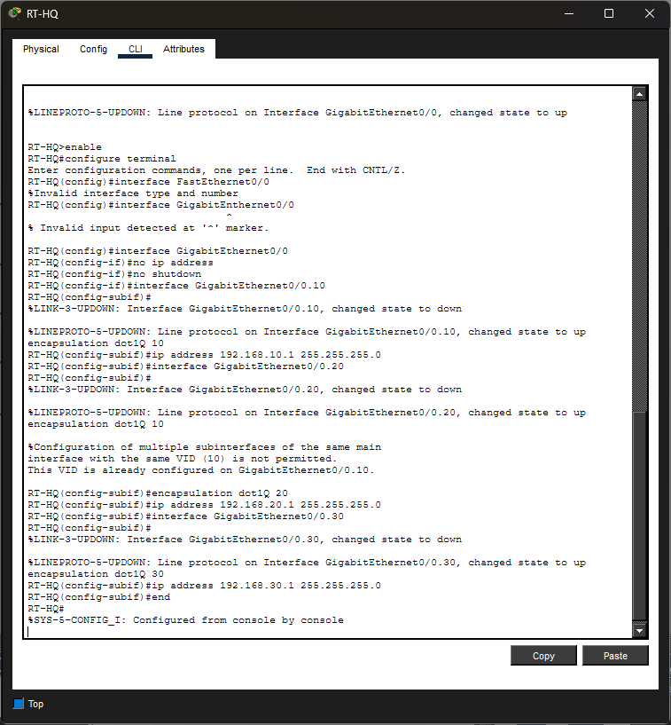

---

### Step 8 — Updating DHCP Pools on the Server

The server's old single DHCP pool no longer works — each VLAN now needs its own pool. I Click `SRV-HQ` → **Services → DHCP** and delete the old `OfficePool`. Create three new pools:

**Pool 1 — Management**

| Field | Value |
|---|---|
| Pool Name | ManagementPool |
| Default Gateway | 192.168.10.1 |
| DNS Server | 192.168.30.2 |
| Start IP Address | 192.168.10.100 |
| Subnet Mask | 255.255.255.0 |
| Max Users | 50 |

**Pool 2 — Staff**

| Field | Value |
|---|---|
| Pool Name | StaffPool |
| Default Gateway | 192.168.20.1 |
| DNS Server | 192.168.30.2 |
| Start IP Address | 192.168.20.100 |
| Subnet Mask | 255.255.255.0 |
| Max Users | 50 |

> Note: Packet Tracer's server DHCP service handles requests from all VLANs automatically as long as the router subinterfaces are configured correctly.

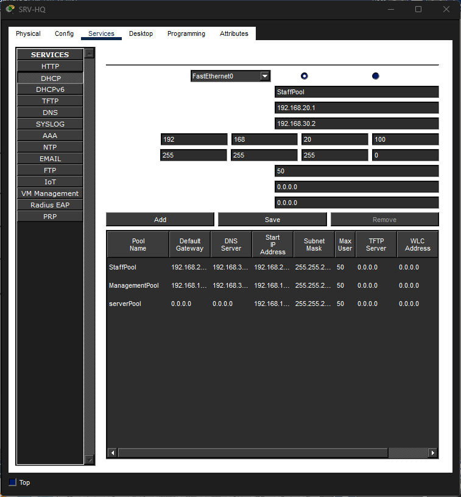

---

### Step 9 — Update Static IPs on Server and Printer

I clicked `SRV-HQ` → **Desktop → IP Configuration** and update to the VLAN 30 addressing:

| Field | Value |
|---|---|
| IP Address | 192.168.30.2 |
| Subnet Mask | 255.255.255.0 |
| Default Gateway | 192.168.30.1 |
| DNS Server | 192.168.30.2 |

Iclicked `PRT-HQ` → **Config → FastEthernet0** and updateed:

| Field | Value |
|---|---|
| IP Address | 192.168.30.50 |
| Subnet Mask | 255.255.255.0 |
| Default Gateway | 192.168.30.1 |

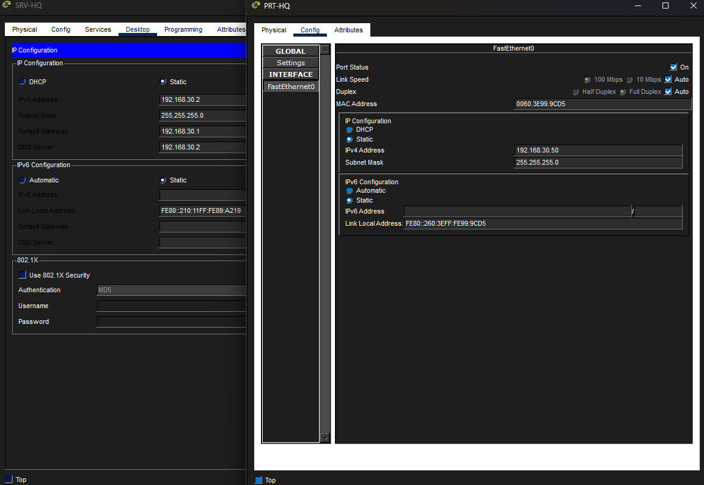
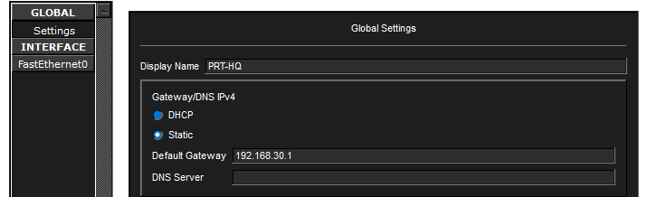

---

### Step 10 — Setting PCs Back to DHCP

I clicked each PC → **Desktop → IP Configuration → DHCP**. Each PC should receive an address from the correct pool based on its VLAN:

- PC-Office-1 and PC-Office-2 → `192.168.10.x`
- PC-Office-3, 4, and 5 → `192.168.20.x`

There seeems to be an issue. DHCP request failed. So the first thing I did to start troubleshooting was to check the DHCP configuration on the server and the first thing I saw was the server pool. 

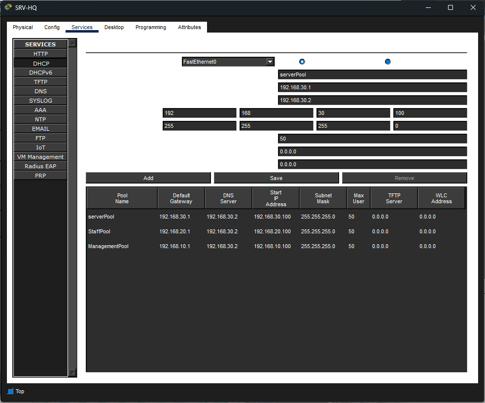

Default gateway and DNS server were set to 0 so I changed these values to staffpool's values.

Second thing I wanted to check was `RT-HQ` since broadcasts don't cross VLANs on real equipment, even though Packet Tracer usually handles this automatically, I set the router subinterface for each VLAN and ip `helper-address` with the following commands:

```
configure terminal

interface GigabitEthernet0/0.10
 ip helper-address 192.168.30.2

interface GigabitEthernet0/0.20
 ip helper-address 192.168.30.2

interface GigabitEthernet0/0.30
 ip helper-address 192.168.30.2

end
```

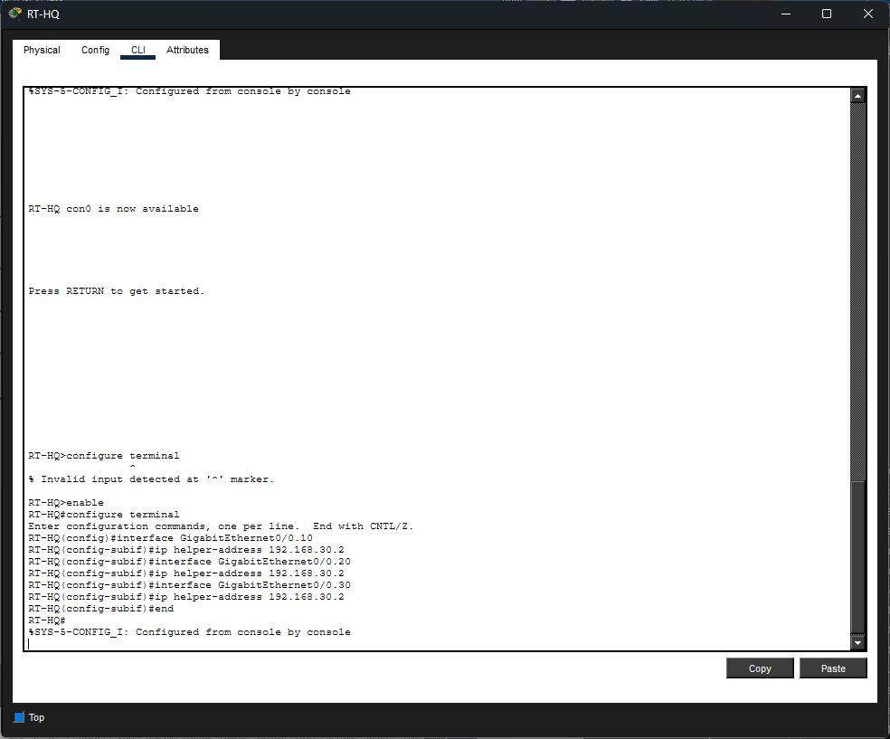

After this troubleshooting, DHCP requests were successful on all PCs:

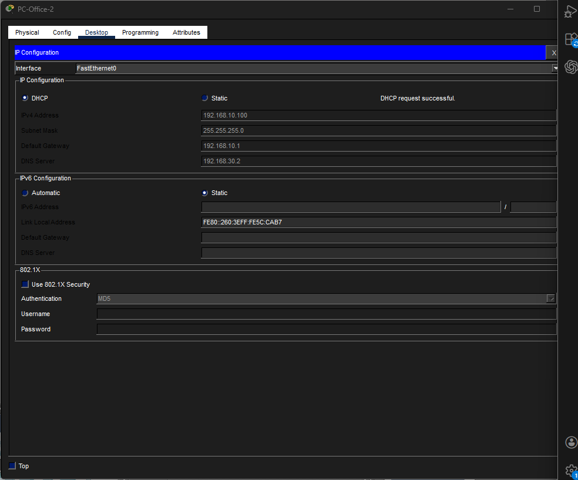

Troublesoohting time: **12 minutes**

---

### Step 11 — Verifying VLAN Isolation

On `PC-Office-1` (VLAN 10) I clicked → **Desktop → Command Prompt**, tryed pinging a VLAN 20 PC directly without going through the router. This should **fail** if VLANs are isolated correctly:

```
ping 192.168.20.100
```

A request timeout confirms the VLANs are properly separated at Layer 2.

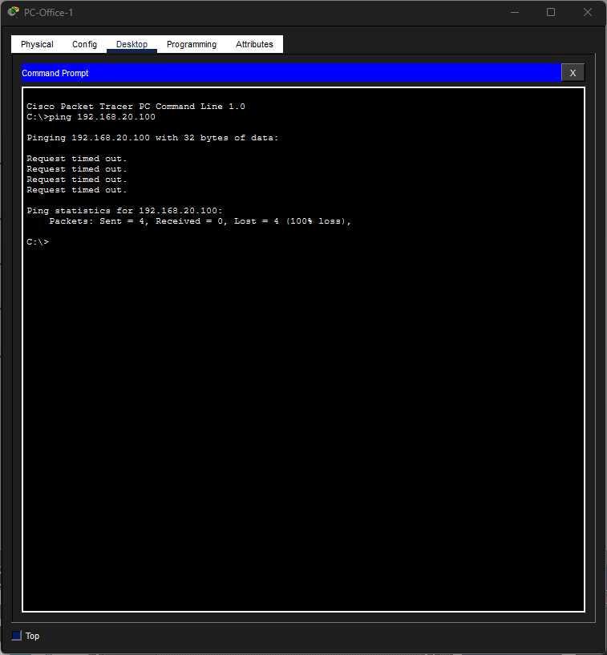

---

### Step 12 — Verifying Inter-VLAN Routing

Now pinging across VLANs through the router. From `PC-Office-1`:

```
ping 192.168.20.100   ← Staff PC (VLAN 20)
ping 192.168.30.2     ← Server (VLAN 30)
ping 192.168.30.50    ← Printer (VLAN 30)
```

These should all succeed because the router is routing between the VLANs via its subinterfaces.

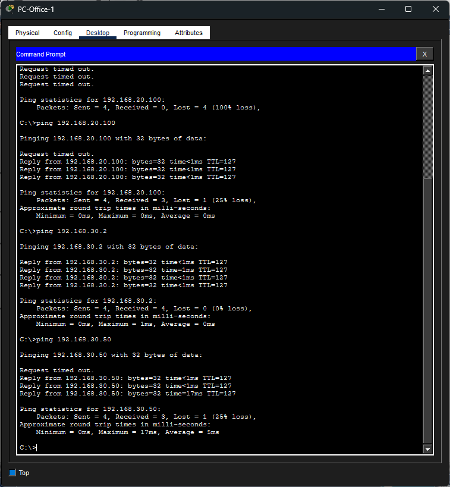

---

### Step 13 — Verifying Web Server Still Works

On any PC → **Desktop → Web Browser** and navigate to:

```
http://construction-inc.local
```

The internal website should still load, confirming DNS and HTTP still work across VLANs.

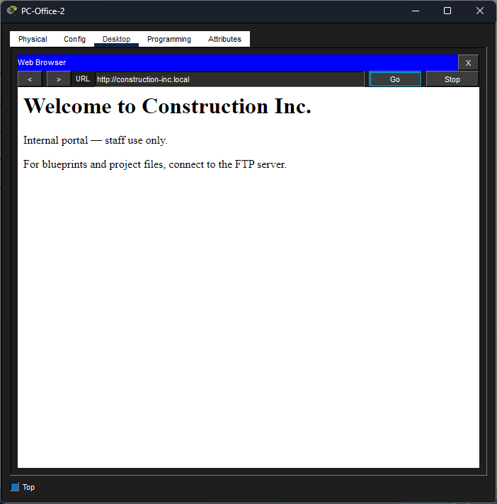

---

### Step 14 — Final show Commands

On `SW-HQ` CLI, I ran these commands and screenshot the output — they demonstrate my understanding of the switch configuration:

```
show vlan brief
show interfaces trunk
show mac address-table
```

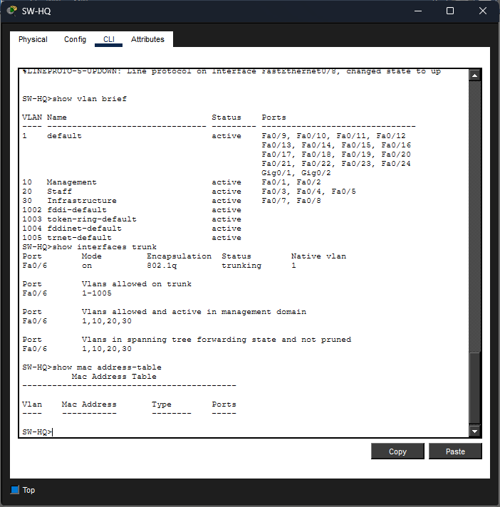

---

### Troubleshooting & Lessons Learned

## Trunk Port — Wrong Port Assumed

When configuring the trunk link in Step 6, I assumed the uplink to RT-HQ was on Fa0/24 based on the lab guide. After running show interfaces trunk and getting no output, and then running show interfaces FastEthernet0/24 switchport, I found:

```
Operational Mode: down
```

The port was configured as a trunk but physically down — meaning no cable was actually connected to it. I hovered over the cable between SW-HQ and RT-HQ in Packet Tracer and discovered the uplink was on Fa0/6 instead.
Lesson: Always verify which physical port a cable is connected to before configuring it. Never assume port numbers from a guide match your actual topology. In Packet Tracer, hovering over a cable shows both port names instantly. On a real switch, use:

```
show interfaces status
show cdp neighbors
```
show cdp neighbors is especially useful in real Cisco environments as it shows exactly which device is connected to which port without needing physical access to trace cables.

## Fa0/6 Conflict — Access Port vs Trunk Port

During the VLAN 30 access port assignment, I incorrectly assigned Fa0/6 as an access port on VLAN 30, not knowing it was the uplink to the router. Later when trying to set it as a trunk, the switch threw an error because the port already had an access VLAN configured.

On a Cisco switch, a port cannot be both an access port and a trunk port. I will always identify uplink ports first and mark them as trunks before assigning access VLANs to the remaining ports. A good habit is to use show interfaces status at the start of any switch configuration to map out which ports have active links before touching anything.

---

## What I Learned

- Why flat networks are a security and management problem
- How to create and name VLANs on a Cisco switch via CLI
- The difference between access ports and trunk ports
- How 802.1Q tagging works on a trunk link
- How to configure Router-on-a-Stick using subinterfaces
- Why devices on different VLANs cannot communicate by default
- How inter-VLAN routing allows controlled communication between departments
- How to update DHCP pools to serve multiple subnets
- Workflow habits to make sure that I avoid silly mistakes

---

## Compared to Previous Labs

| | Lab 02 | Lab 03 | Lab 04 |
|---|---|---|---|
| Network type | Flat | Flat | Segmented (VLANs) |
| Subnets | 1 | 1 | 3 |
| Switch config | GUI only | GUI only | CLI (VLANs, trunk) |
| Router config | Basic interface | Basic interface | Subinterfaces (RoaS) |
| Security | None | None | Department isolation |
| DHCP | Single pool | Single pool | Per-VLAN pools |

---

## Files

```
lab-04-construction-inc-vlans/
├── README.md
├── construction-inc-pt3.pkt        ← Packet Tracer save file
└── screenshots/
    ├── 01-open-lab03.png
    ├── 02-create-vlans.png
    ├── 03-vlan10-ports.png
    ├── 04-vlan20-ports.png
    ├── 05-vlan30-ports.png
    ├── 06-trunk-port.png
    ├── 07-router-subinterfaces.png
    ├── 08-dhcp-pools.png
    ├── 09-static-ip-update.png
    ├── 10-pc-dhcp-verify.png
    ├── 11-vlan-isolation.png
    ├── 12-intervlan-routing.png
    ├── 13-http-verify.png
    ├── 14-show-vlan-brief.png
    └── 14-show-interfaces-trunk.png
```