# Lab 05 — Riverstone Legal: Connecting Two Sites Over a WAN Link

**Tool:** Cisco Packet Tracer
**Difficulty:** Intermediate
**New concepts:** Serial WAN links, static routing, RIP dynamic routing, inter-site connectivity

---

## Scenario

Riverstone Legal is a law firm with two offices — a main headquarters in the city centre and a smaller branch office across town. Both offices have their own local networks, but staff at the branch need to access the company's internal web server and file server hosted at HQ.

As the network technician, I will build both office networks from scratch, connect them over a WAN serial link, and configure routing so that branch staff can reach HQ resources. I will first do this with static routes, then migrate to RIP to understand the difference between manual and dynamic routing.

---

## Objectives

- Build two separate office networks with their own routers and switches
- Connect the two sites using a serial WAN link
- Configure static routes so both sites can reach each other
- Verify branch PCs can access the HQ server by name and IP
- Migrate from static routing to RIP and verify nothing breaks
- Understand the difference between static and dynamic routing in practice

---

## Topology

```
[ HQ Site ]                          [ Branch Site ]
                    WAN LINK
PC-HQ-1 ──┐                          ┌── PC-BR-1
PC-HQ-2 ──┤                          ├── PC-BR-2
PC-HQ-3 ──┼── SW-HQ ── RT-HQ ════ RT-BR ── SW-BR ──┤
SRV-HQ  ──┘                                         └── PC-BR-3
         192.168.1.0/24   10.0.0.0/30   192.168.2.0/24
```

The `═══` represents the serial WAN link between the two routers.

---

## Network Design

### Subnets

| Network | Subnet | Purpose |
|---|---|---|
| HQ LAN | 192.168.1.0/24 | All HQ devices |
| Branch LAN | 192.168.2.0/24 | All branch devices |
| WAN Link | 10.0.0.0/30 | Serial link between RT-HQ and RT-BR |

> A /30 subnet gives exactly 2 usable host addresses — perfect for a point-to-point link between two routers where only the two router interfaces need IPs.

### IP Addressing

| Device | Interface | IP Address | Subnet Mask | Gateway |
|---|---|---|---|---|
| RT-HQ | Fa0/0 (LAN) | 192.168.1.1 | 255.255.255.0 | — |
| RT-HQ | Se0/0 (WAN) | 10.0.0.1 | 255.255.255.252 | — |
| RT-BR | Se0/0 (WAN) | 10.0.0.2 | 255.255.255.252 | — |
| RT-BR | Fa0/0 (LAN) | 192.168.2.1 | 255.255.255.0 | — |
| SRV-HQ | — | 192.168.1.2 | 255.255.255.0 | 192.168.1.1 |
| PC-HQ-1 to 3 | — | DHCP | 255.255.255.0 | 192.168.1.1 |
| PC-BR-1 to 3 | — | DHCP | 255.255.255.0 | 192.168.2.1 |

### Why /30 for the WAN link?

A /30 subnet (`255.255.255.252`) gives only 2 usable host IPs. A serial link between two routers only ever needs exactly 2 IPs — one per router interface. Using a /24 here would waste 253 addresses on a link that will never have more than two devices. Efficient subnetting like this is a core CCNA concept.

---

## Part 1 — Building the HQ Site

### Step 1 — Adding HQ's Devices

I added the following devices to the left side of my workspace:

- 1x `2911` Router — name it `RT-HQ`
- 1x `2960` Switch — name it `SW-HQ`
- 3x PCs — I named them `PC-HQ-1`, `PC-HQ-2`, `PC-HQ-3`
- 1x Server — `SRV-HQ`

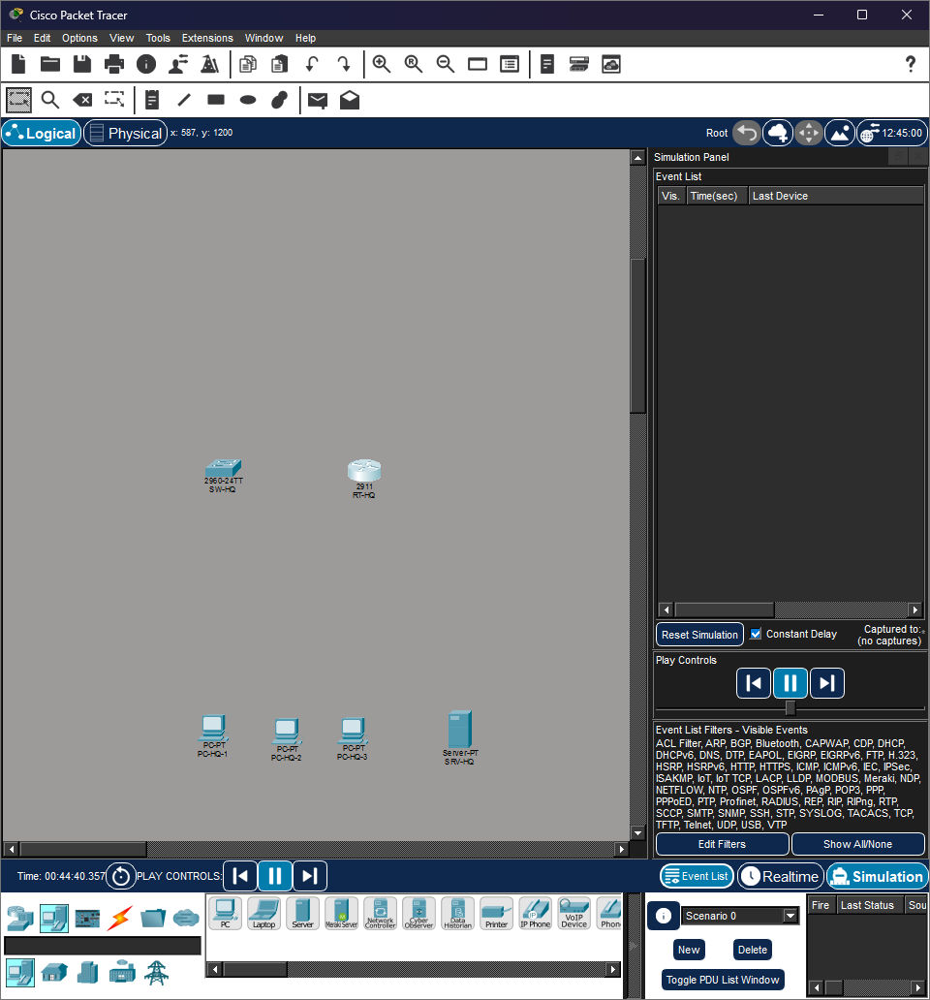

---

### Step 2 — Connecting HQ Devices

I used **Copper Straight-Through** cables to connect:
- `PC-HQ-1`, `PC-HQ-2`, `PC-HQ-3` → `SW-HQ`
- `SRV-HQ` → `SW-HQ`
- `SW-HQ` → `RT-HQ` (Fa0/0)

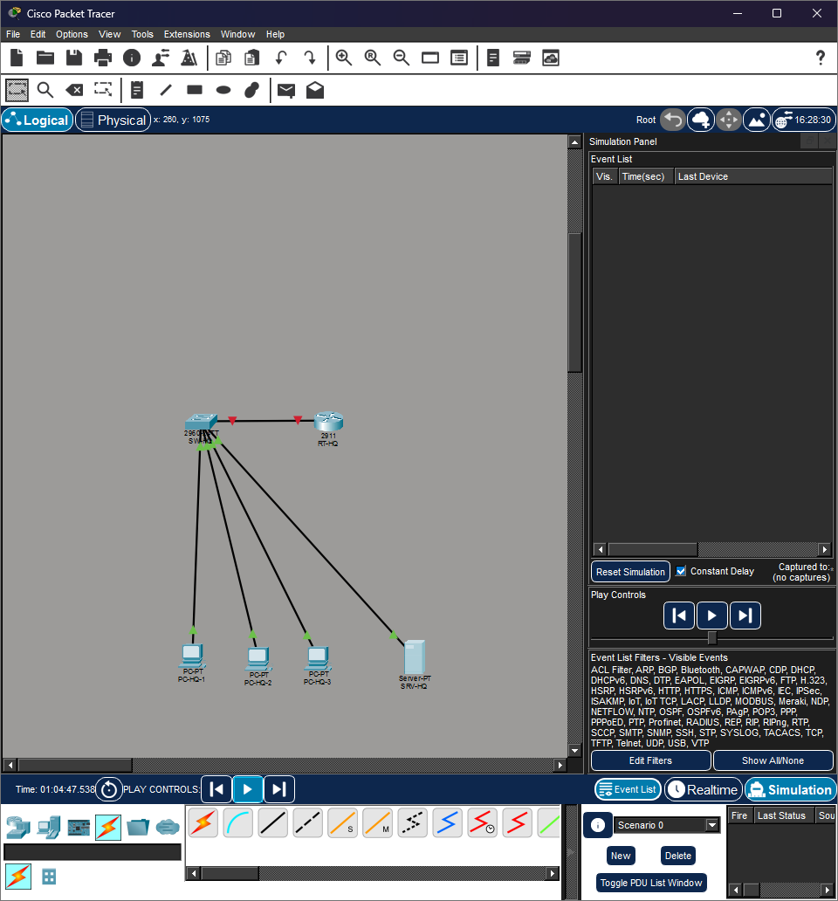

---

### Step 3 — Configuring RT-HQ LAN Interface

Click `RT-HQ` → **CLI**:

```
enable
configure terminal

interface GigabitEthernet0/0
 ip address 192.168.1.1 255.255.255.0
 no shutdown

end
```

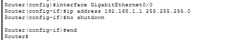

---

### Step 4 — Configuring SRV-HQ Static IP

I clicked `SRV-HQ` → **Desktop → IP Configuration**:

| Field | Value |
|---|---|
| IPv4 Address | 192.168.1.2 |
| Subnet Mask | 255.255.255.0 |
| Default Gateway | 192.168.1.1 |
| DNS Server | 192.168.1.2 |

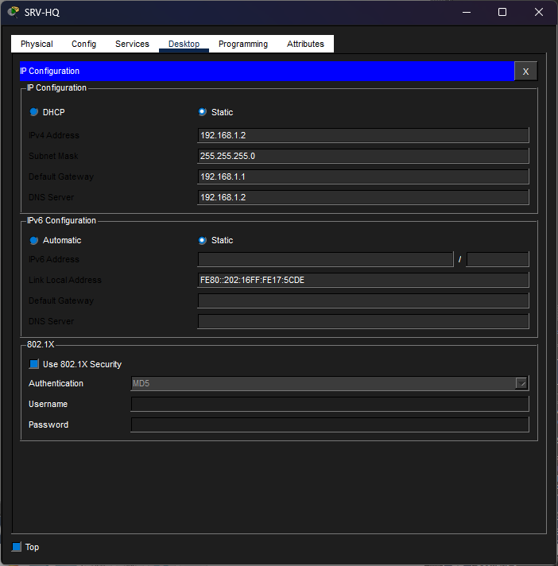

---

### Step 5 — Configuring DHCP on SRV-HQ

Clicked `SRV-HQ` → **Services → DHCP**:

| Field | Value |
|---|---|
| Pool Name | HQPool |
| Default Gateway | 192.168.1.1 |
| DNS Server | 192.168.1.2 |
| Start IP Address | 192.168.1.100 |
| Subnet Mask | 255.255.255.0 |
| Max Users | 50 |

Toggled DHCP **On** and clicked **Save**.

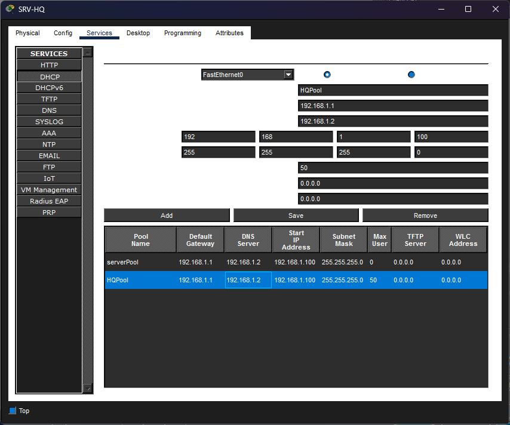

---

### Step 6 — Configuring DNS and HTTP on SRV-HQ

**DNS** → `SRV-HQ` → **Services → DNS**, added:

| Name | Type | Address |
|---|---|---|
| riverstone-legal.local | A Record | 192.168.1.2 |

Toggled DNS **On**.

**HTTP** → clicked **Services → HTTP**, toggle **On** and edited `index.html`:

```html
<html>
  <head><title>Riverstone Legal</title></head>
  <body>
    <h1>Riverstone Legal — Internal Portal</h1>
    <p>Authorised staff only. Branch office users: contact HQ IT for access.</p>
  </body>
</html>
```

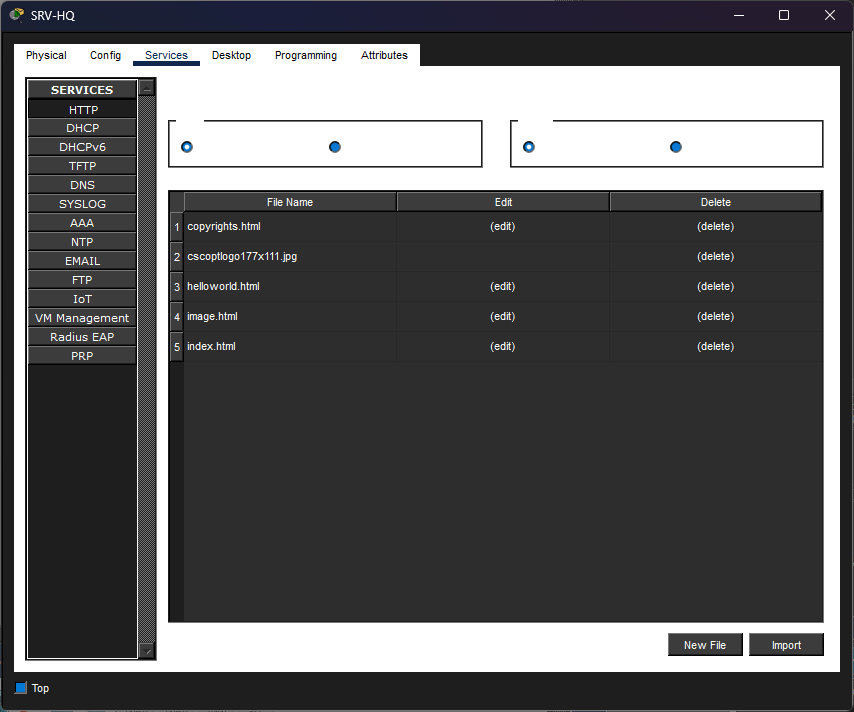
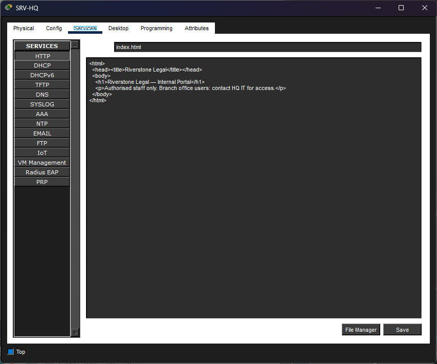

---

### Step 7 — Setting HQ PCs to DHCP

I clicked each HQ PC → **Desktop → IP Configuration → DHCP**. Each should receive an address in the `192.168.1.100+` range.

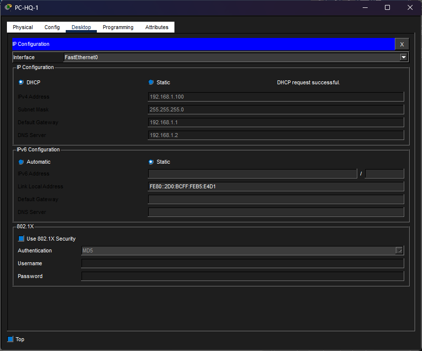

---

## Part 2 — Building the Branch Site

### Step 8 — Adding Branch Devices

Add the following to the right side of your workspace:

- 1x `2911` Router — named it `RT-BR`
- 1x `2960` Switch — named it `SW-BR`
- 3x PCs — named them `PC-BR-1`, `PC-BR-2`, `PC-BR-3`

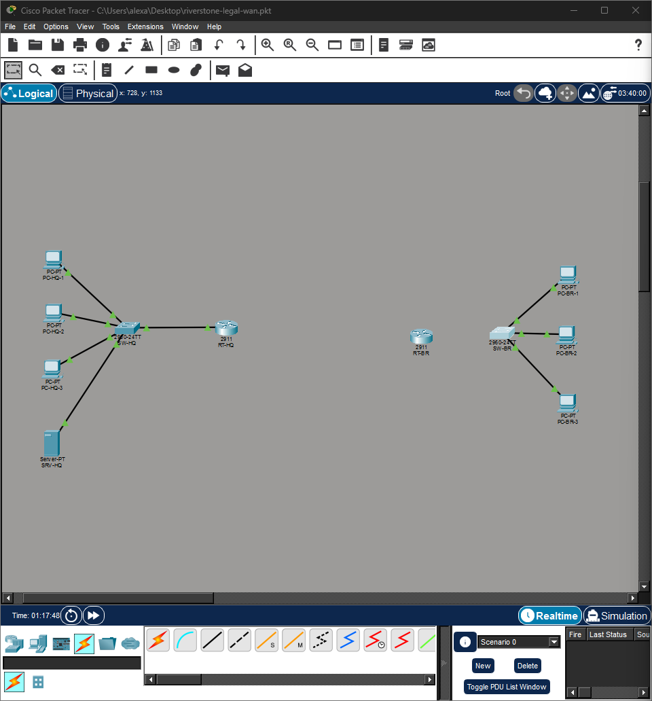

---

### Step 9 — Connect Branch Devices

I used **Copper Straight-Through** cables to connect:
- `PC-BR-1`, `PC-BR-2`, `PC-BR-3` → `SW-BR`
- `SW-BR` → `RT-BR` (Ga0/0)

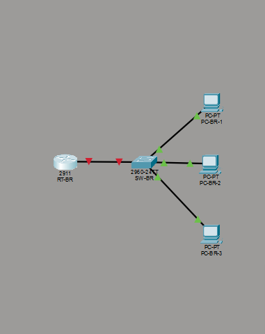

---

### Step 10 — Configuring RT-BR LAN Interface

I clicked `RT-BR` → **CLI**:

```
enable
configure terminal

interface GigabitEthernet0/0
 ip address 192.168.2.1 255.255.255.0
 no shutdown

end
```

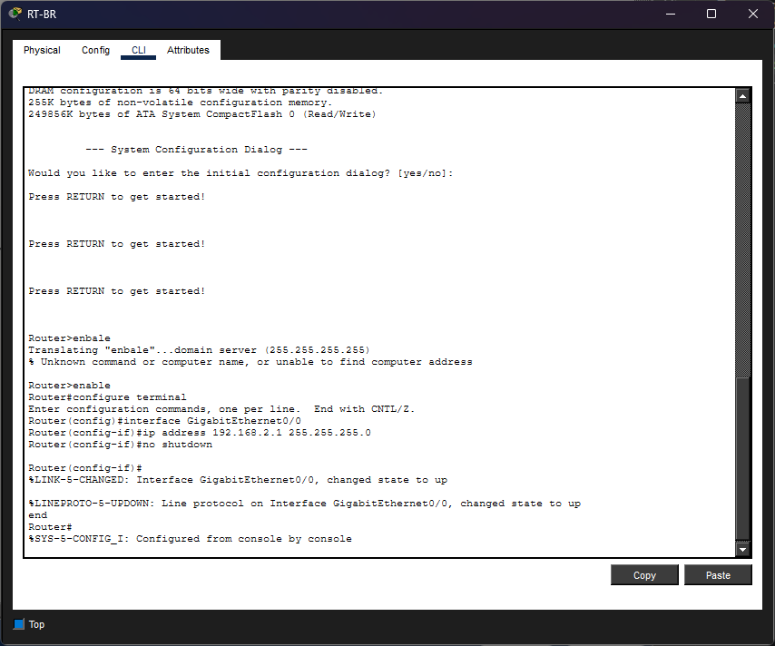

---

### Step 11 — Configuring DHCP on RT-BR

For the branch, I will configure DHCP directly on the router instead of a server,  this is called a **router DHCP pool** and is very common in small branch offices that don't have or need a dedicated server.

In the opened **CLI**:

```
enable
configure terminal

ip dhcp pool BranchPool
 network 192.168.2.0 255.255.255.0
 default-router 192.168.2.1
 dns-server 192.168.1.2

ip dhcp excluded-address 192.168.2.1 192.168.2.99

end
```

> `excluded-address` reserves `.1` through `.99` for static assignments, so DHCP only hands out `.100` and above, the same convention used at HQ.

> The DNS server points to `192.168.1.2` (SRV-HQ at HQ) — this means branch PCs will use the HQ server for DNS once the WAN link is up.

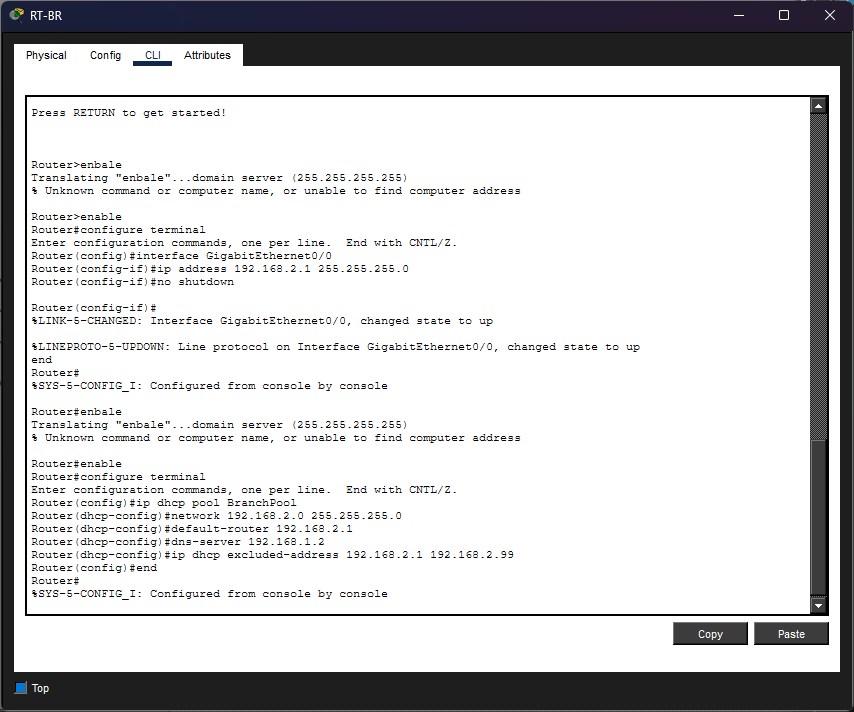

---

### Step 12 — Setting Branch PCs to DHCP

Clicked each branch PC → **Desktop → IP Configuration → DHCP**. Again, each should receive an address in the `192.168.2.100+` range.

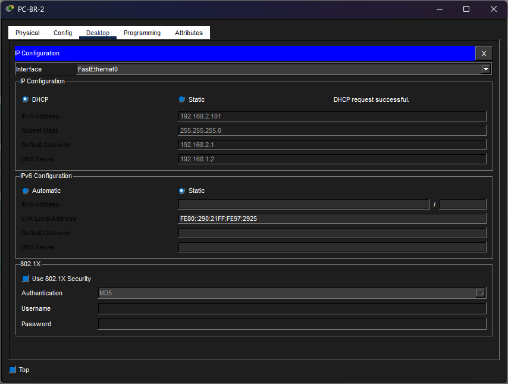

---

## Part 3 — The WAN Link

### Step 13 — Adding a Serial WAN Link

In Packet Tracer, to create a serial link we need to add a **HWIC-2T serial module** to both routers first.

I found this module in `RT-HQ` → **Physical tab** → powered off the router by clicking the power button → then dragged a `HWIC-2T` module into an empty slot → power back on. Repeated this procedure for `RT-BR`.

Then I used a **Serial DCE** cable to connect:
- `RT-HQ` Se0/0/0 → `RT-BR` Se0/0/0

> The DCE end of the cable sets the clock rate — whichever router has the DCE end must configure `clock rate`. Packet Tracer will show a small clock icon on the DCE side.

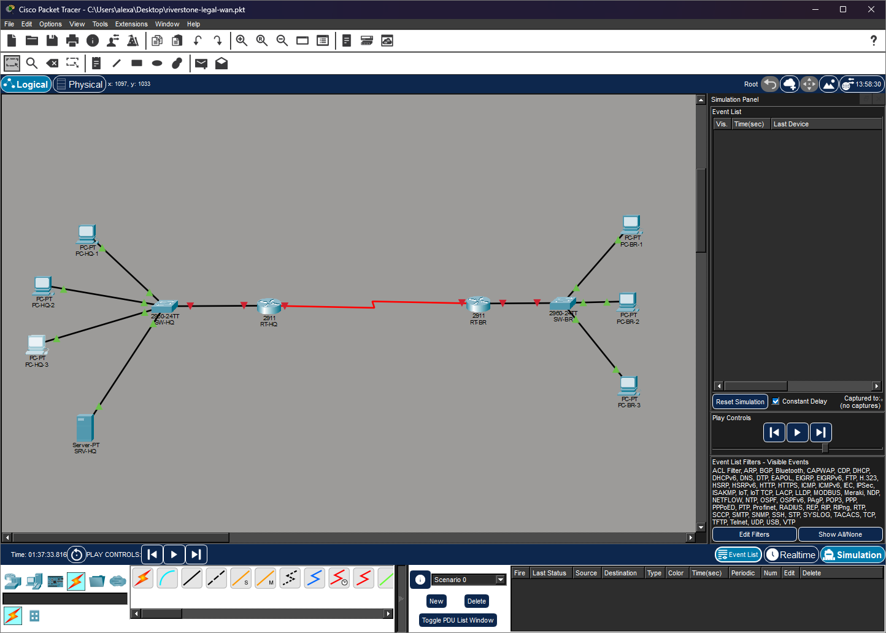

---

### Step 14 — Configuring WAN Interfaces

**On RT-HQ CLI:**

```
enable
configure terminal

interface Serial0/0/0
 ip address 10.0.0.1 255.255.255.252
 no shutdown

end
```

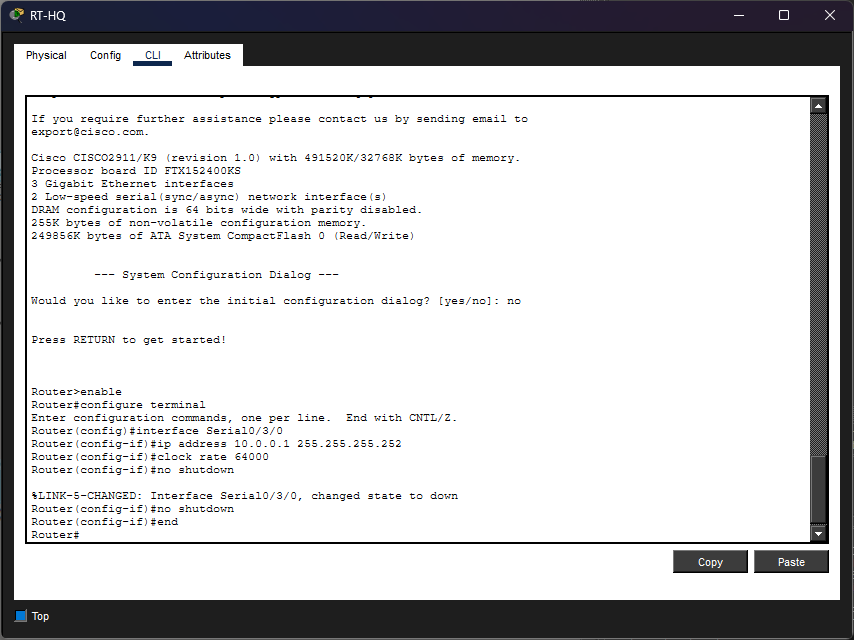


**On RT-BR CLI:**

```
enable
configure terminal

interface Serial0/0/0
 ip address 10.0.0.2 255.255.255.252
 clock rate 64000
 no shutdown

end
```

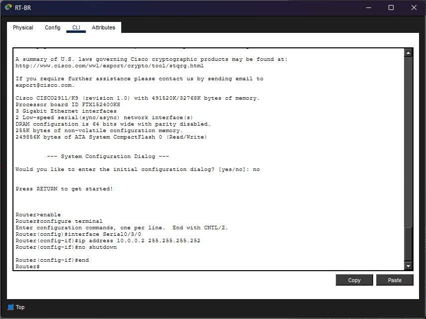

> Only the DCE side needs `clock rate`. If we are unsure which side is DCE, we run `show controllers Serial0/0/0` — it will say DCE or DTE.


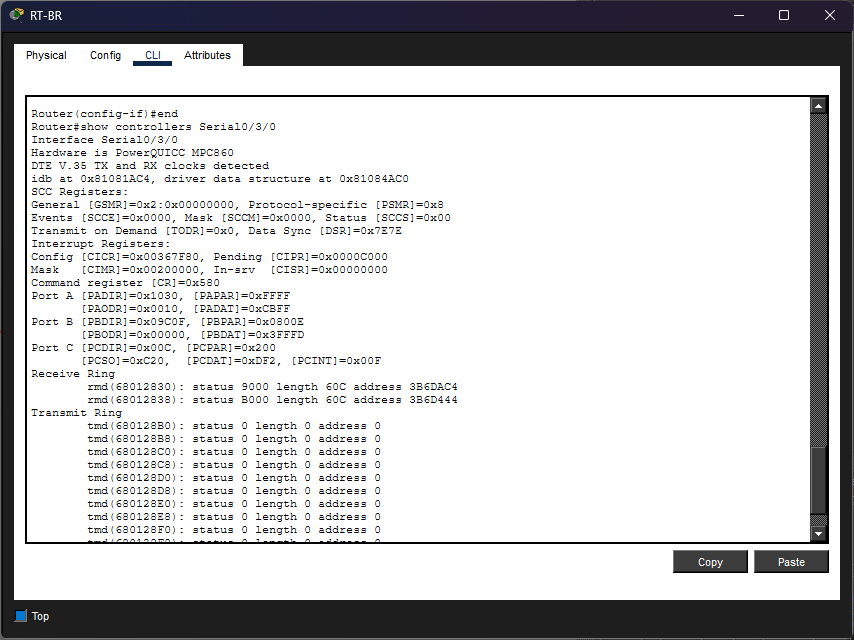

Verifying the link is up on both routers:

```
show interfaces Serial0/3/0
```

I initially made a mistake when configuring the routers, by having the interfaces GigabitEthernet0/0 on a down state. I fixed this by entering both routers CLIs and entering

```
configure terminal

    interface GigabitEthernet0/0
    no shutdown
end
```


Now we look for `Serial0/3/0 is up, line protocol is up`.

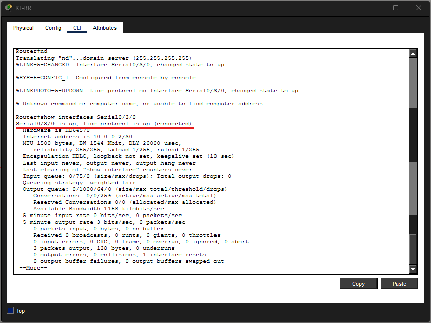

---

## Part 4 — Static Routing

At this point both sites have working local networks but cannot reach each other. RT-HQ knows about `192.168.1.0/24` and `10.0.0.0/30` but has no idea `192.168.2.0/24` exists and vice versa. Static routes fix this by manually telling each router where to send traffic for the other site.

### Step 15 — Adding Static Routes

**On RT-HQ CLI** - we tell HQ router how to reach the branch network:

```
enable
configure terminal

ip route 192.168.2.0 255.255.255.0 10.0.0.2

end
```

**On RT-BR CLI** - we tell branch router how to reach the HQ network:

```
enable
configure terminal

ip route 192.168.1.0 255.255.255.0 10.0.0.1

end
```

To verify routes are installed:

```
show ip route
```

We look for lines beginning with `S` (Static)

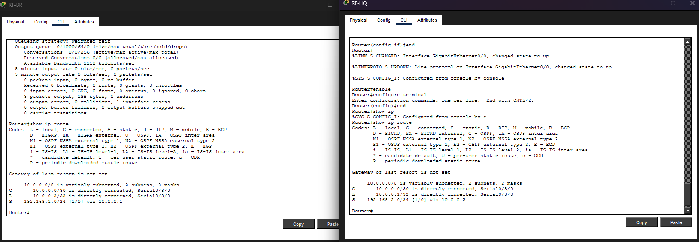

---

### Step 16 — Verifying Cross-Site Connectivity

From `PC-BR-1` → **Desktop → Command Prompt**:

```
ping 192.168.1.1    ← RT-HQ (HQ gateway)
ping 192.168.1.2    ← SRV-HQ (HQ server)
ping 192.168.1.100  ← a HQ PC
```

All three should succeed.

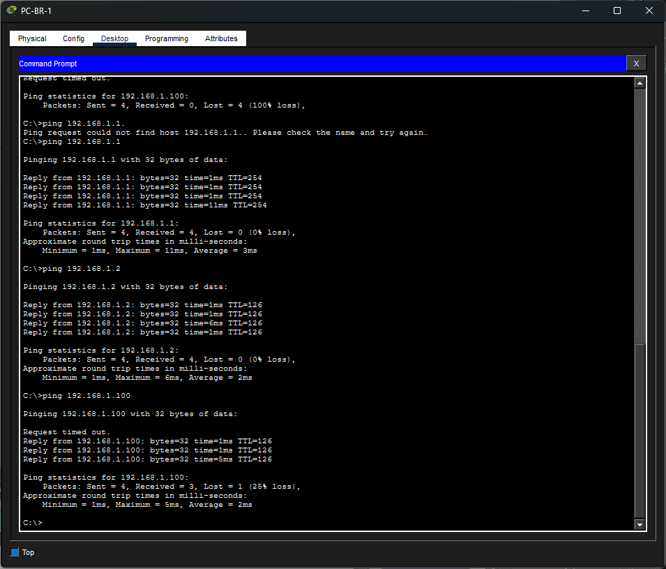

---

### Step 17 — Verifying Branch Can Access HQ Server by Name

From `PC-BR-1` → **Desktop → Web Browser**:

```
http://riverstone-legal.local
```

The Riverstone Legal internal homepage should load — confirming that DNS resolution is working across the WAN link and that the branch can reach HQ services by name.

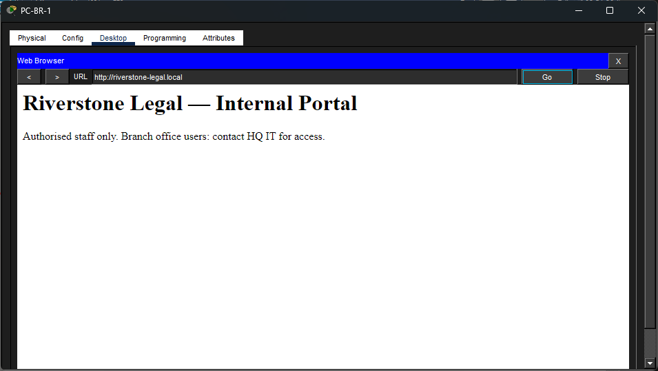

---

## Part 5 — Migrating to RIP

Static routes work well for small networks, but they have a major problem: they don't adapt. If a link goes down or a new network is added, an administrator must manually update every router. **RIP (Routing Information Protocol)** is a dynamic routing protocol where routers automatically share their routing tables with each other and adapt to changes.

### Static vs RIP — Key Differences

| | Static Routes | RIP |
|---|---|---|
| Configuration | Manual on every router | Configured once, routers share automatically |
| Adapts to changes | No — admin must update manually | Yes — routers recalculate automatically |
| Best for | Small, simple, stable networks | Networks that may change or grow |
| CCNA exam weight | Foundation concept | Core routing protocol |

---

### Step 18 — Removing Static Routes

Before adding RIP,we remove the static routes I just configured in Step 15.

**On RT-HQ CLI:**

```
enable
configure terminal

no ip route 192.168.2.0 255.255.255.0 10.0.0.2

end
```

**On RT-BR CLI:**

```
enable
configure terminal

no ip route 192.168.1.0 255.255.255.0 10.0.0.1

end
```

Verify they are gone:

```
show ip route
```

The `S` entries should no longer appear. At this point cross-site pings will fail again — that is expected.

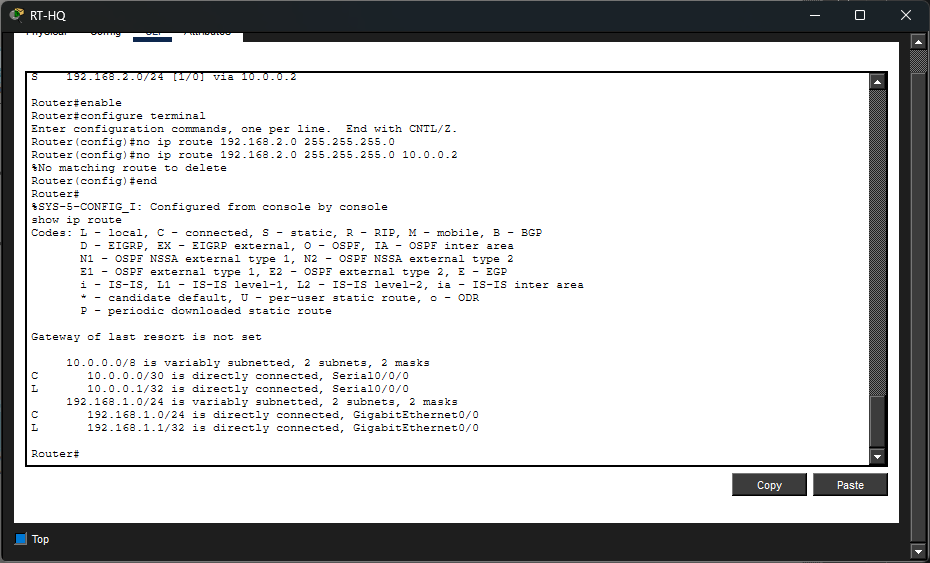

---

### Step 19 — Configuring RIP on RT-HQ

```
enable
configure terminal

router rip
 version 2
 network 192.168.1.0
 network 10.0.0.0
 no auto-summary

end
```

> `no auto-summary` prevents RIP from summarising routes to classful boundaries, which causes problems with modern subnetting. I think w should always include this with RIPv2.

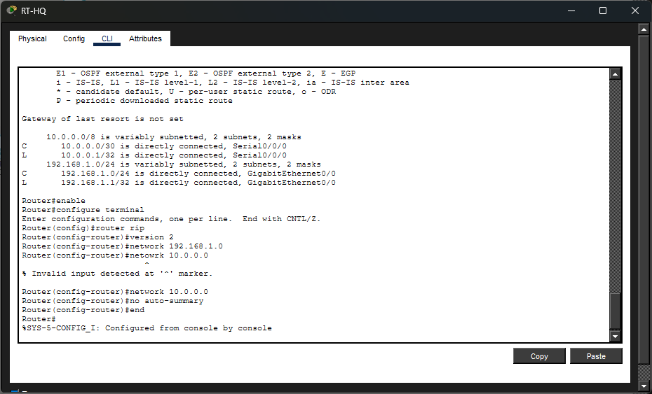

---

### Step 20 — Configuring RIP on RT-BR

```
enable
configure terminal

router rip
 version 2
 network 192.168.2.0
 network 10.0.0.0
 no auto-summary

end
```

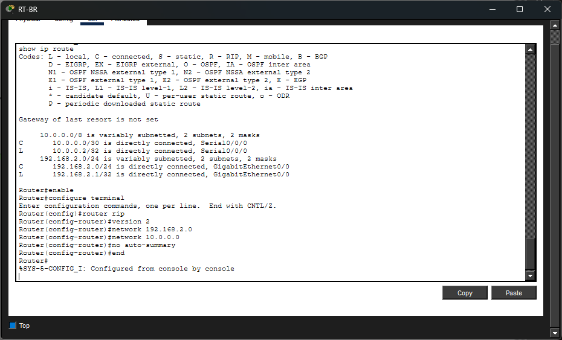

---

### Step 21 — Verifying RIP is Working

On either router I typed:

```
show ip route
```

We should now see `R` entries (R = RIP) for the remote network. For example on RT-HQ you should see:

```
R    192.168.2.0/24 [120/1] via 10.0.0.2
```

I also ran:

```
show ip protocols
```

This confirms RIP is running and shows which networks are being advertised.

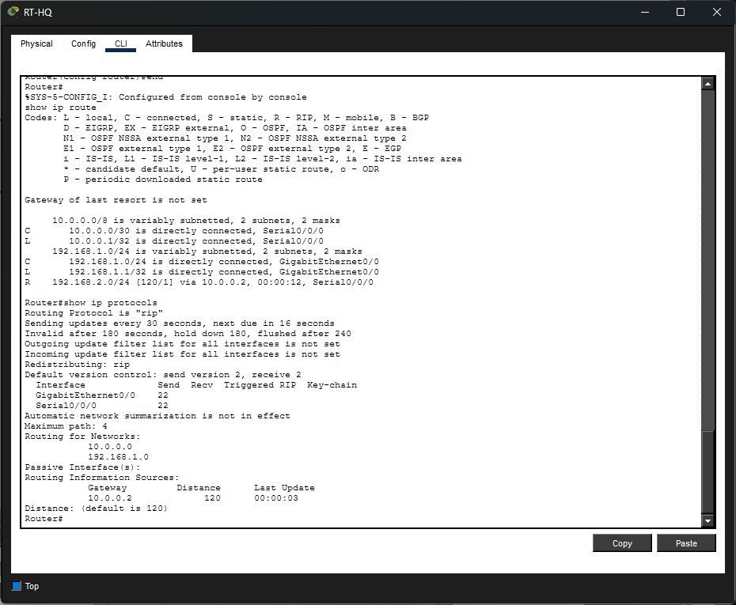

---

### Step 22 — Verifying Full Connectivity is Restored

Repeated the same tests from Steps 16 and 17 — cross-site pings and the web browser test. Everything should work exactly as before, now driven by RIP instead of static routes.

```
ping 192.168.1.2
```

```
http://riverstone-legal.local
```

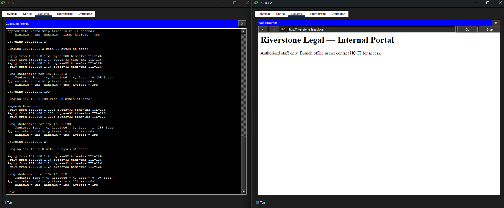

---

## What I Learned

- How to design a multi-site network with separate subnets per location
- Why a /30 subnet is used for point-to-point WAN links
- How to add serial WAN modules to Cisco routers in Packet Tracer
- How to configure and verify a serial WAN link including clock rate
- How static routes work and how to verify them with `show ip route`
- The limitations of static routing in growing networks
- How to configure RIPv2 and why `no auto-summary` matters
- The difference between `S` (static) and `R` (RIP) entries in the routing table
- How branch office PCs can reach a server hosted at HQ over a WAN link

---

## Compared to Previous Labs

| | Lab 04 | Lab 05 |
|---|---|---|
| Sites | 1 | 2 (HQ + Branch) |
| Routers | 1 | 2 |
| WAN link | None | Serial point-to-point |
| Routing | None (same LAN) | Static → RIP |
| Subnets | 3 (VLANs) | 3 (HQ, Branch, WAN) |
| Server access | Local only | Cross-site over WAN |

---

## Files

```
lab-05-riverstone-legal-wan/
├── README.md
├── riverstone-legal-wan.pkt              ← Packet Tracer save file
└── screenshots/
    ├── 01-hq-devices.png
    ├── 02-hq-connections.png
    ├── 03-rthq-lan.png
    ├── 04-srvhq-ip.png
    ├── 05-hq-dhcp.png
    ├── 06-hq-services.png
    ├── 07-hq-pc-dhcp.png
    ├── 08-branch-devices.png
    ├── 09-branch-connections.png
    ├── 10-rtbr-lan.png
    ├── 11-branch-dhcp.png
    ├── 12-branch-pc-dhcp.png
    ├── 13-wan-link.png
    ├── 14-wan-interfaces.png
    ├── 15-static-routes.png
    ├── 16-cross-site-ping.png
    ├── 17-branch-web-access.png
    ├── 18-static-removed.png
    ├── 19-rip-hq.png
    ├── 20-rip-br.png
    ├── 21-rip-verify.png
    └── 22-rip-connectivity.png
```