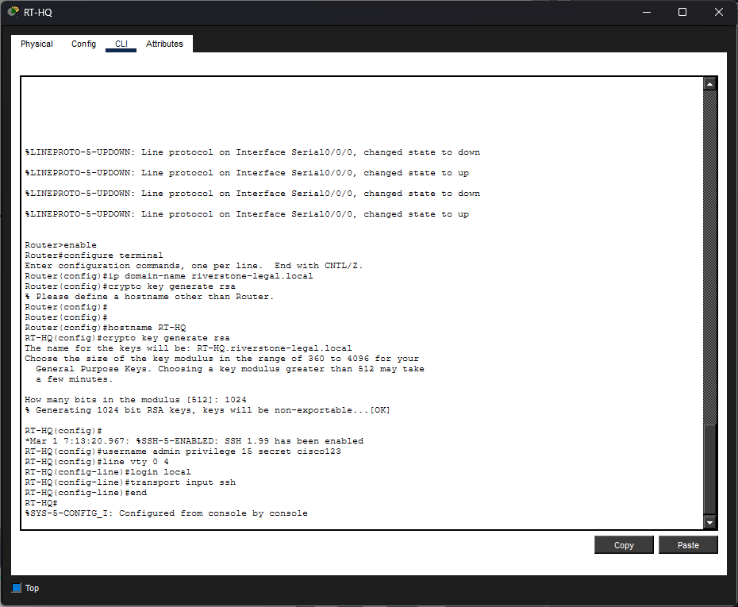
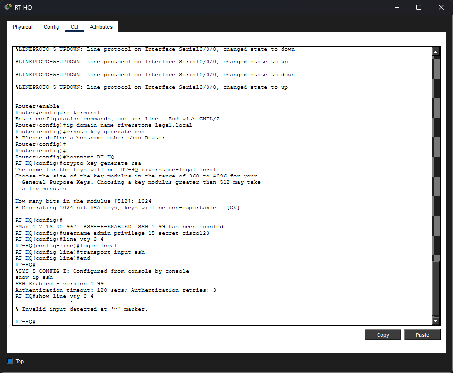
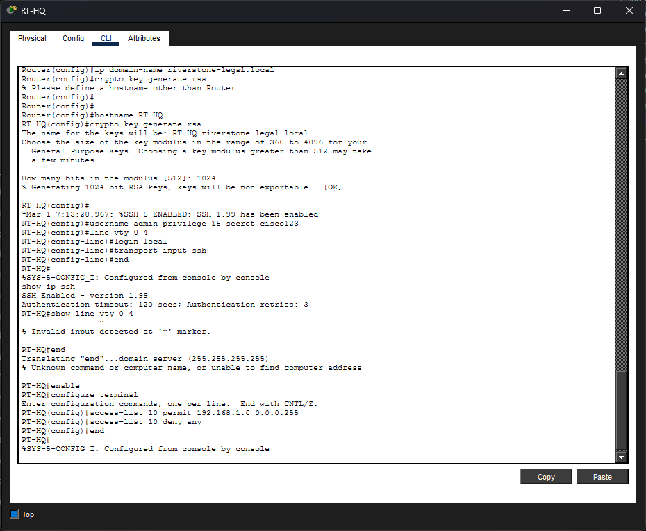
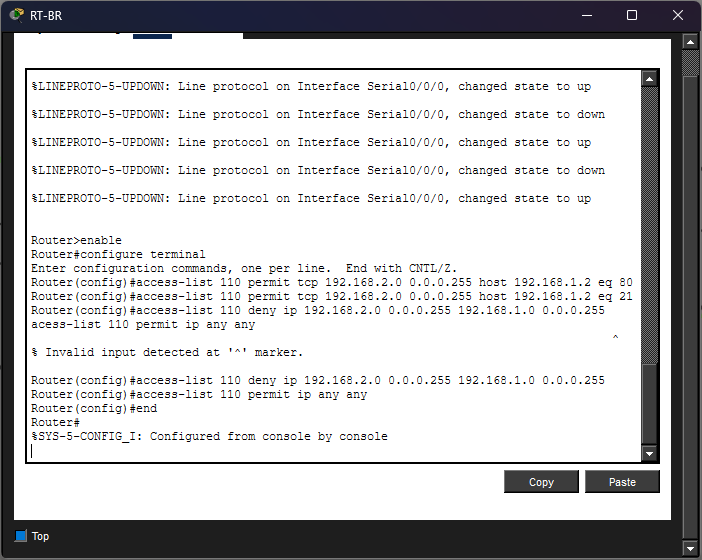
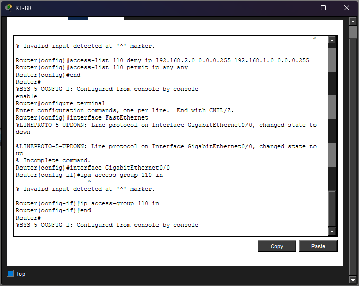
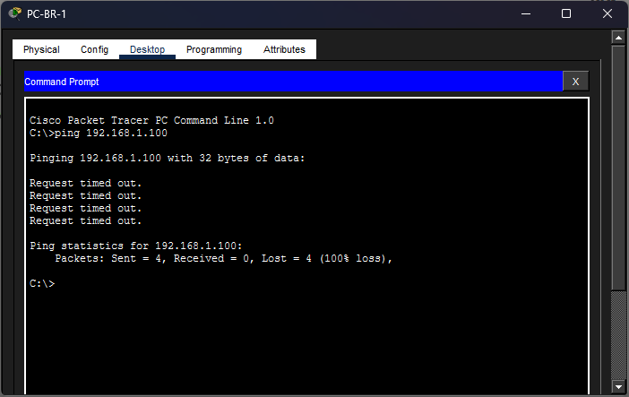
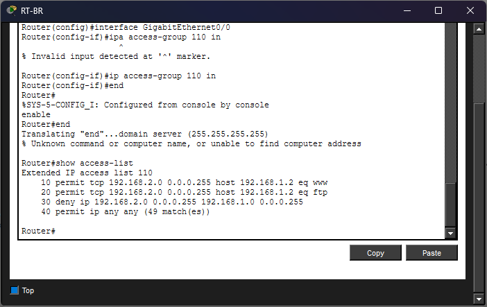

# Lab 06 — Riverstone Legal: Access Control Lists (ACLs)

**Tool:** Cisco Packet Tracer  
**Difficulty:** Intermediate  
**Builds on:** Lab 05 — Riverstone Legal WAN & Routing  
**New concepts:** Standard ACLs, Extended ACLs, traffic filtering, SSH access control

---

## Scenario

Riverstone Legal's IT manager has raised a security concern. Now that the branch office can reach HQ over the WAN link, there is no restriction on what branch users can actually do on the HQ network. A paralegal at the branch can freely ping the managing partner's PC, attempt to access the router CLI, or probe any HQ device without restriction.

The firm's security policy requires the following:

1. Branch PCs can access the HQ web server (HTTP) and file server (FTP)
2. Branch PCs cannot directly ping or access HQ staff PCs
3. Only the HQ network can access the router CLI (SSH)
4. All other inter-site traffic is blocked by default

As the network technician, I will implement these rules using standard and extended ACLs on the routers.

---

## Objectives

- Understand the difference between standard and extended ACLs
- Write and apply a standard ACL to restrict SSH access to RT-HQ
- Write and apply an extended ACL to filter branch traffic at the HQ boundary
- Verify permitted traffic works and blocked traffic is denied
- Understand where to place ACLs for maximum efficiency

---

## Key Concepts Before We Start

### What is an ACL?

An ACL is an ordered list of permit and deny rules that a router applies to traffic passing through an interface. The router reads rules top to bottom and stops at the first match. If no rule matches, the traffic is dropped — this is the **implicit deny all** at the end of every ACL.

### Standard vs Extended ACLs

| | Standard ACL | Extended ACL |
|---|---|---|
| Filters by | Source IP only | Source IP, destination IP, protocol, port |
| Numbered range | 1–99 | 100–199 |
| Placement rule | As close to the **destination** as possible | As close to the **source** as possible |
| Use case | Simple broad blocks | Precise traffic control |

### Why placement matters

Standard ACLs only know the source IP so if you place them near the source, you risk blocking traffic to *all* destinations, not just the one you want to restrict. Extended ACLs know both source and destination, so placing them near the source stops unwanted traffic early and saves bandwidth.

---

## Topology

Same as Lab 05 — no new devices needed.

```
[ HQ Site ]                          [ Branch Site ]
                    WAN LINK
PC-HQ-1 ──┐                          ┌── PC-BR-1
PC-HQ-2 ──┤                          ├── PC-BR-2
PC-HQ-3 ──┼── SW-HQ ── RT-HQ ════ RT-BR ── SW-BR ──┤
SRV-HQ  ──┘                                         └── PC-BR-3
         192.168.1.0/24   10.0.0.0/30   192.168.2.0/24
```

### Security Policy Summary

| Traffic | Action |
|---|---|
| Branch → HQ web server (HTTP port 80) | ✅ Permit |
| Branch → HQ file server (FTP port 21) | ✅ Permit |
| Branch → HQ PCs (any) | ❌ Deny |
| Branch → RT-HQ SSH (port 22) | ❌ Deny |
| HQ → anywhere | ✅ Permit (unrestricted) |
| Non-HQ → RT-HQ SSH | ❌ Deny |
| HQ → RT-HQ SSH | ✅ Permit |

---

## Part 1 — Standard ACL: Restricting SSH Access to RT-HQ

Standard ACLs filter by source IP only making them a good fit for this rule: only allow the HQ network (`192.168.1.0/24`) to SSH into the router. Everyone else is blocked.

### Step 1 — Enable SSH on RT-HQ

Before applying an ACL to SSH, make sure SSH is actually configured on RT-HQ. Click `RT-HQ` → **CLI**:

```
enable
configure terminal

ip domain-name riverstone-legal.local
crypto key generate rsa
```

When prompted for key size enter `1024`.

```
username admin privilege 15 secret cisco123

line vty 0 4
 login local
 transport input ssh

end
```



---

### Step 2 — Test SSH Before the ACL

From `RT-HQ` → **CLI**:

```
ssh -l admin 192.168.1.1
```

We should see SSH enabled



---

### Step 3 — Writing the Standard ACL

On `RT-HQ` CLI, we create a standard ACL numbered `10` that permits the HQ subnet and implicitly denies everything else:

```
enable
configure terminal

access-list 10 permit 192.168.1.0 0.0.0.255
access-list 10 deny any

end
```

> The `0.0.0.255` is a **wildcard mask** — the inverse of a subnet mask. `0` means the bit must match, `255` means any value is accepted. So `0.0.0.255` means "match any host in this /24 network."



---

### Step 4 — Applying the ACL to the VTY Lines

An ACL restricting SSH must be applied to the VTY lines (the virtual terminal lines used for remote access), not to a physical interface.

```
enable
configure terminal

line vty 0 4
 access-class 10 in

end
```

> `access-class` is used for VTY lines. `ip access-group` is used for physical interfaces. These are different commands — using the wrong one is a common mistake.

---

## Part 2 — Extended ACL: Filtering Branch Traffic at HQ

Extended ACLs filter by source IP, destination IP, protocol, and port giving you precise control. The security policy says branch PCs can reach the HQ server (HTTP and FTP) but cannot reach HQ PCs or the router directly.

Because this is an extended ACL, it goes as close to the **source** as possible on `RT-BR`, applied inbound on the LAN interface facing the branch PCs.

### Step 6 — Planning the ACL Rules

Before writing any commands, we plan the rules in order:

| Rule | Action | Protocol | Source | Destination | Port |
|---|---|---|---|---|---|
| 1 | Permit | TCP | 192.168.2.0/24 | 192.168.1.2 (SRV-HQ) | 80 (HTTP) |
| 2 | Permit | TCP | 192.168.2.0/24 | 192.168.1.2 (SRV-HQ) | 21 (FTP) |
| 3 | Deny | IP | 192.168.2.0/24 | 192.168.1.0/24 | any |
| 4 | Permit | IP | any | any | any |

> Rule 4 permits all other traffic (HQ to branch, etc.) — without it the implicit deny would block everything, including return traffic from HQ to branch.

---

### Step 7 — Writing the Extended ACL on RT-BR

We click `RT-BR` → **CLI**:

```
enable
configure terminal

access-list 110 permit tcp 192.168.2.0 0.0.0.255 host 192.168.1.2 eq 80
access-list 110 permit tcp 192.168.2.0 0.0.0.255 host 192.168.1.2 eq 21
access-list 110 deny ip 192.168.2.0 0.0.0.255 192.168.1.0 0.0.0.255
access-list 110 permit ip any any

end
```

> `host 192.168.1.2` is shorthand for `192.168.1.2 0.0.0.0` and it matches exactly one IP address.
> `eq 80` means "destination port equals 80."



---

### Step 8 — Applying the Extended ACL

We apply ACL 110 inbound on RT-BR's LAN interface (the one facing the branch PCs):

```
enable
configure terminal

interface GigabitEthernet0/0
 ip access-group 110 in

end
```



---

### Step 9 — Verifying HTTP is Permitted from Branch

From `PC-BR-1` → **Desktop → Web Browser**:

```
http://riverstone-legal.local
```

The HQ internal website loads, HTTP to SRV-HQ is permitted by rule 1.


---

### Step 10 — Verifying Direct Access to HQ PCs is Denied

From `PC-BR-1` → **Desktop → Command Prompt**, ping a HQ PC:

```
ping 192.168.1.100
```

This should time out — rule 3 denies all IP traffic from the branch subnet to the HQ subnet (except the server rules above).



---

### Step 11 — Verifying HQ Can Still Reach Branch

From `PC-HQ-1` → **Desktop → Command Prompt**:

```
ping 192.168.2.100
```

This should succeed, rule 4 permits all other traffic, and HQ-initiated traffic is not affected by the ACL on RT-BR's inbound LAN interface.


---

### Step 12 — Check ACL Hit Counters

On `RT-BR` CLI, verify the ACL is matching traffic correctly:

```
show access-lists
```

Each rule will show a match count, how many packets have hit that rule. This is one of the most useful troubleshooting tools for ACLs.


---

### Step 13 — Verifying Full ACL Summary on Both Routers

Ran on both `RT-HQ` and `RT-BR`:

```
show access-lists
show ip interface GigabitEthernet0/0
```

The second command confirms which ACLs are applied to which interfaces and in which direction.



---

## Common Mistakes

### Implicit deny catches too much

If our ACL blocks traffic that should be allowed, we check whether we are missing a `permit ip any any` at the end. Every ACL has an invisible `deny any` at the bottom, if your legitimate traffic doesn't match a permit rule first, it gets dropped silently.

### Wrong ACL applied to wrong interface direction

ACLs have direction — `in` filters traffic entering the interface, `out` filters traffic leaving it. Applying an inbound ACL to the wrong interface is one of the most common ACL mistakes. Draw the traffic flow on paper before applying.

### Using `access-class` vs `ip access-group`

- `access-class` → VTY lines (SSH, Telnet)
- `ip access-group` → physical interfaces (LAN, WAN)

Using the wrong command will either have no effect or throw an error.

### Standard ACL placed near the source

Standard ACLs only filter by source IP — placing one near the source will block that source from reaching *all* destinations, not just the one you intended. Always place standard ACLs near the destination.

---

## What I Learned

- The difference between standard ACLs (source only) and extended ACLs (source, destination, protocol, port)
- How wildcard masks work and how they differ from subnet masks
- Why ACL placement matters — standard near destination, extended near source
- How to apply an ACL to VTY lines using `access-class`
- How to apply an ACL to a physical interface using `ip access-group`
- The implicit deny at the end of every ACL and why it matters
- How to verify ACL matches using `show access-lists` hit counters
- How to plan ACL rules on paper before writing CLI commands

---

## Compared to Previous Labs

| | Lab 05 | Lab 06 |
|---|---|---|
| Routing | Static → RIP | RIP (unchanged) |
| Security | None | Standard + Extended ACLs |
| SSH access | Open to all | Restricted to HQ subnet only |
| Branch → HQ | Unrestricted | Filtered by policy |
| Verification | Ping + browser | Ping + browser + ACL hit counters |

---

## Files

```
lab-06-riverstone-legal-acls/
├── README.md
├── riverstone-legal-acls.pkt        ← Packet Tracer save file
└── screenshots/
    ├── 01-ssh-config.png
    ├── 02-ssh-before-acl.png
    ├── 03-standard-acl.png
    ├── 04-acl-vty.png
    ├── 05-ssh-verify.png
    └── 06-acl-summary.png
```